# DFS(Depth-First Search)

## DFS 특징

* 깊이 우선 탐색
* 그래프에서 깊은 부분을 우선적으로 탐색하는 알고리즘

### DFS의 동작 과정

DFS는 특정한 경로로 탐색하다가 특정한 상황에서 최대한 깊이 들어가 노드 방문 후 다시 돌아가 경로를 탐색한다.

1. 탐색 시작 노드를 스택에 삽입하여 방문 처리
2. 스택의 최상단 노드에 방문하지 않은 인접 노드가 있는 경우 해당 노드를 스택에 넣고 방문처리 / 방문하지 않은 인접 노드가 없는 경우 최상단에서 노드를 꺼냄
3. 2번의 과정을 더 이상 수행할 수 없을때 까지 반복

> DFS는 순서와 상관없이 처리해도 되지만, 코딩 테스트에선 번호가 낮은 순서부터 처리하도록 명시하는 경우가 종종 있다.

```txt
1. 시작 노드 Push(1)

[1]
```

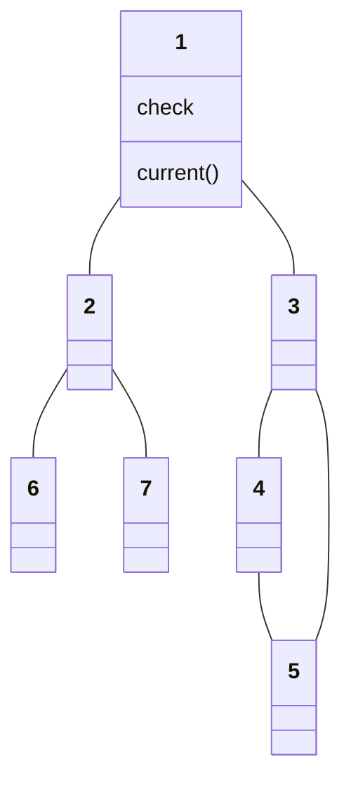

```txt
2. 인접 노드 2,3중 가장 작은 2를 Push(2)
[1][2]
```

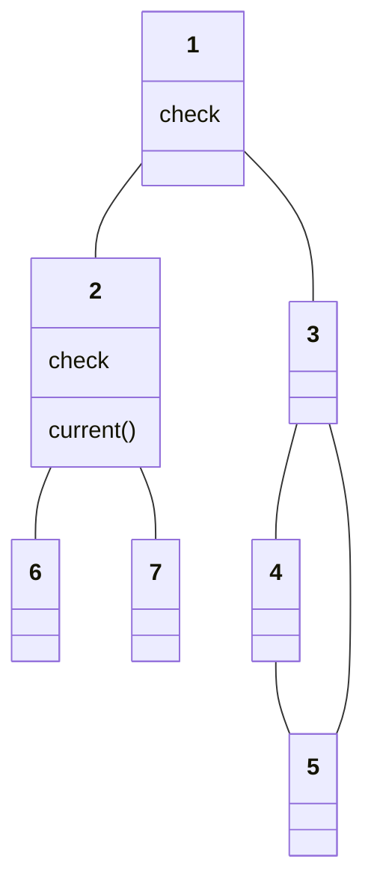

```txt
3. 인접 노드 6, 7중 가장 작은 6 Push(6)
[1][2][6]
```

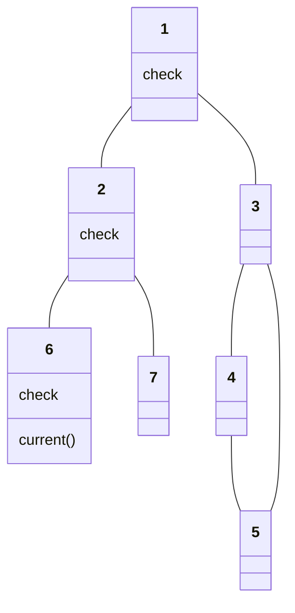

```txt
4. 6에는 인접 노드가 없으므로 Pop()
[1][2]
```

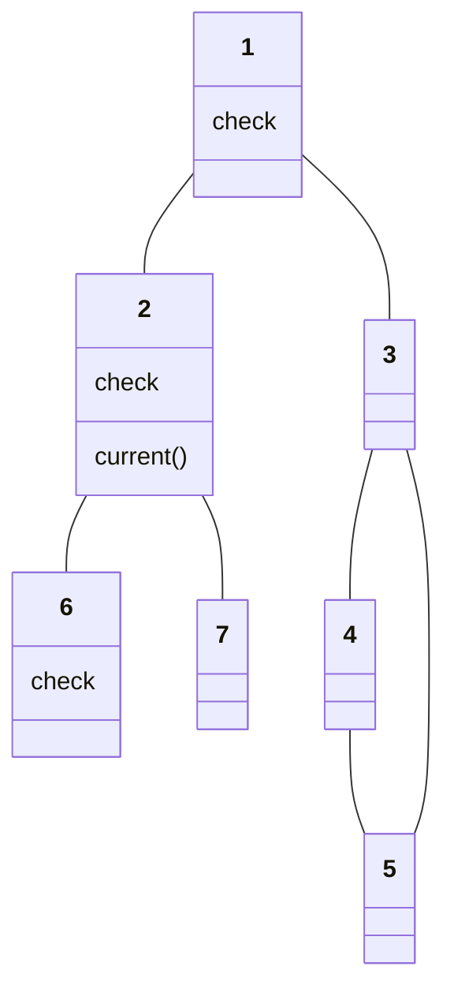

```txt
5. 2에 인접하며 방문하지 않은 7 Push(7)
[1][2][7]
```

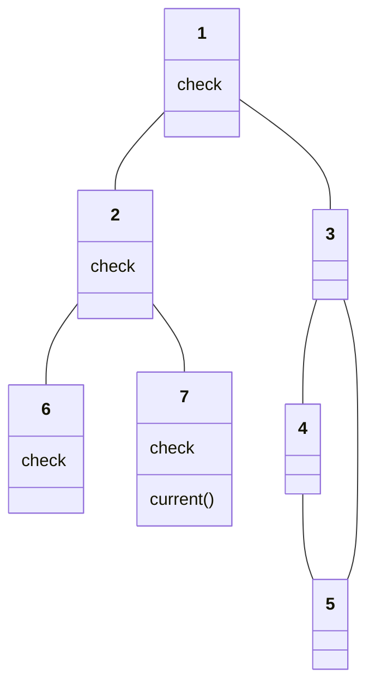

```txt
6. 7에 인접한 노드가 없으므로 Pop()
[1][2]
```

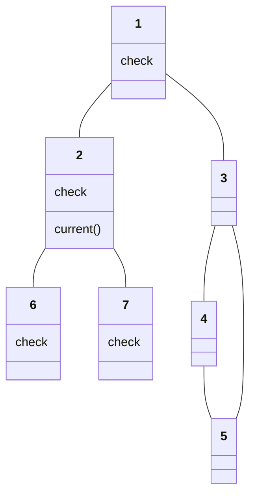

```txt
7. 2에 인접한 노드를 모드 방문 했으므로 Pop()
[1]
```

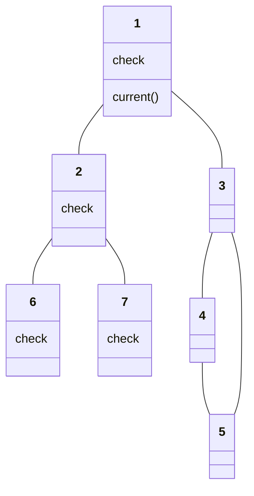

```txt
8. 1에 인접한 노드 중 방문하지 않은 3 Push(3)
[1][3]
```

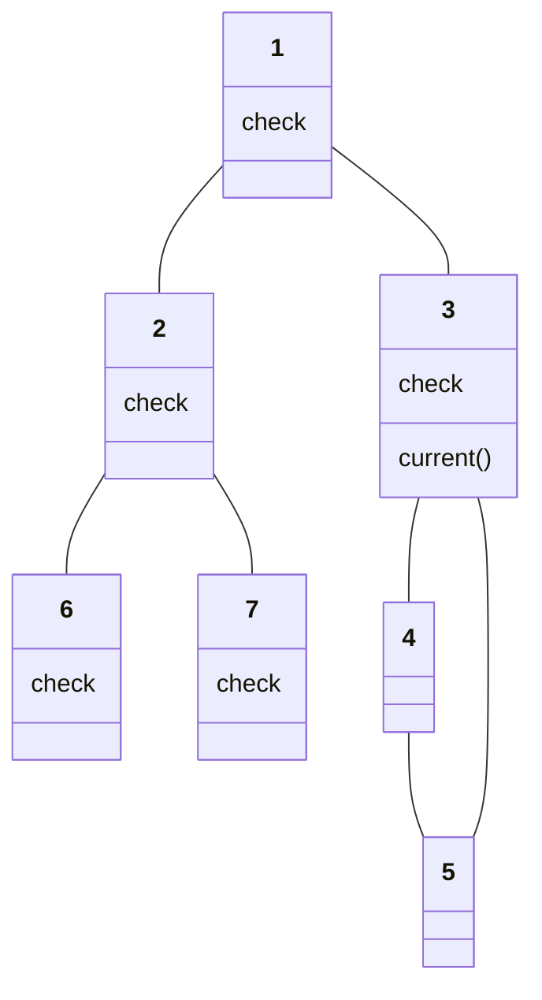

```txt
9. 3에 인접한 노드 중 가장 작은 4 Push(4)
[1][3][4]
```

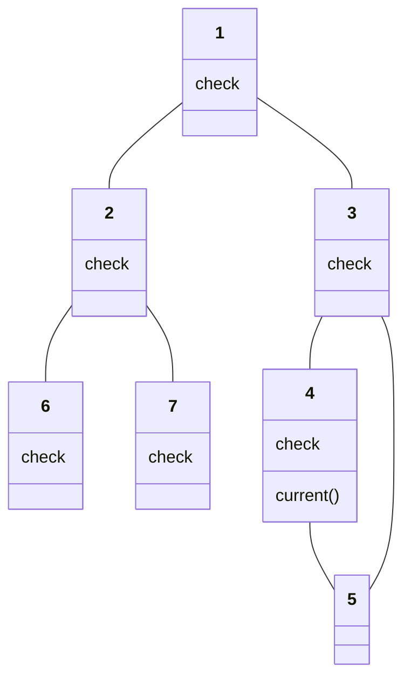

```txt
10. 4에 인접한 노드 5 Push(5)
[1][3][4][5]
```

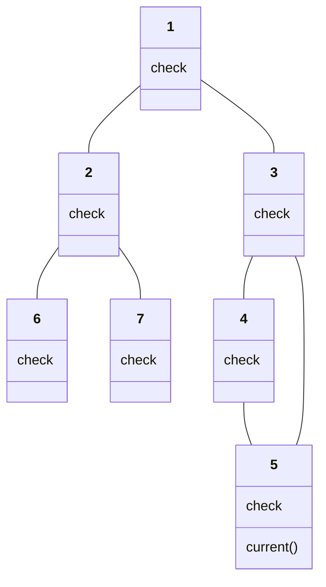

```txt
11. 5에 인접한 노드가 없으므로 pop()
[1][3][4]

12. 4에 방문하지 않은 노드가 없으므로 pop()
[1][3]

13. 3에 방문하지 않은 노드가 없으므로 pop()
[1]

14. 1에 방문하지 않은 노드가 없으므로 pop()
```

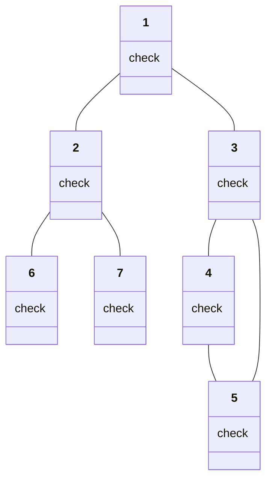

`탐색 순서: 1->2->6->7->3->4->5`

> DFS는 스택을 이용하는 알고리즘이기 때문에 재귀 함수를 이용하여 간결하게 구현할 수 있다.
