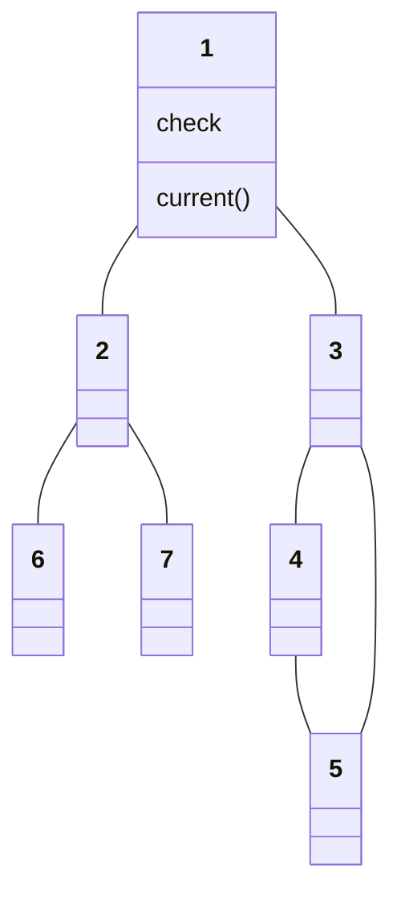
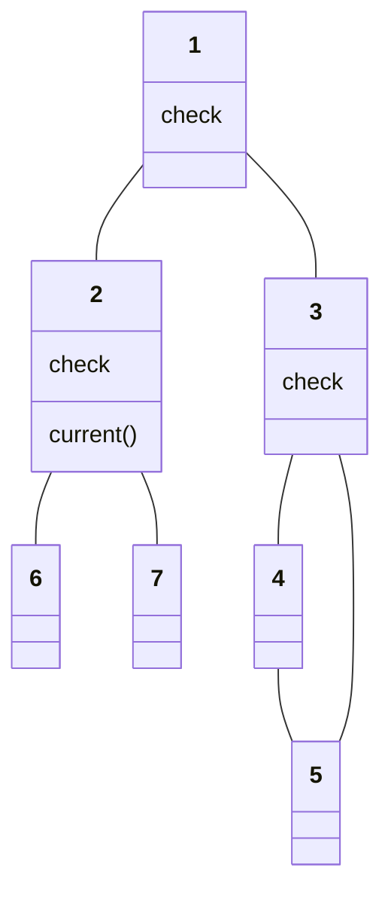
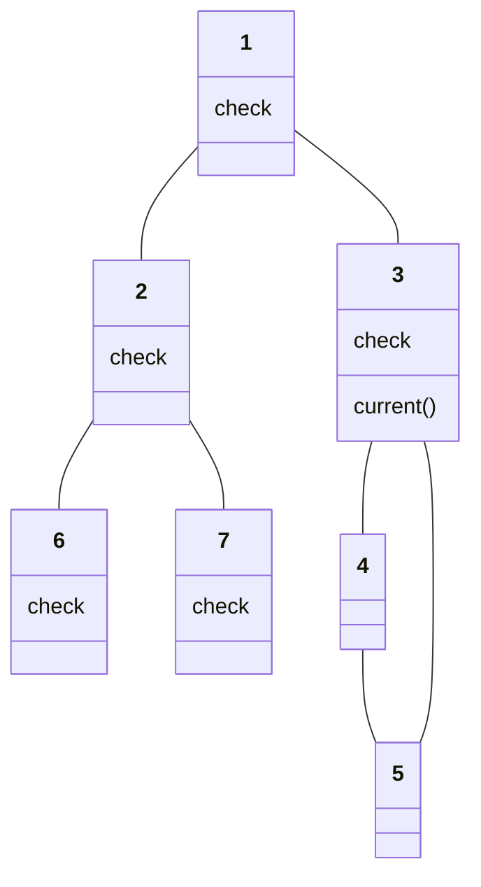
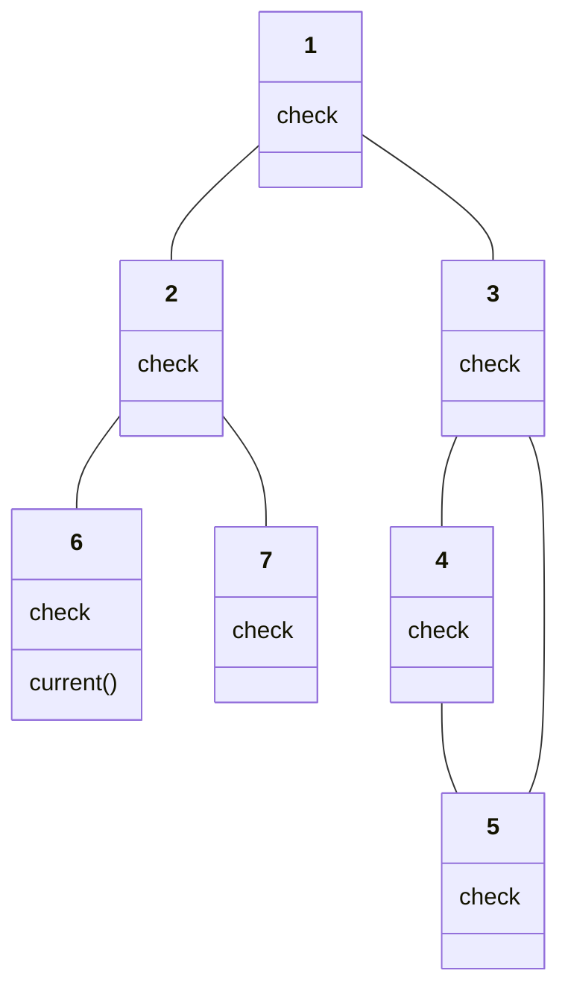
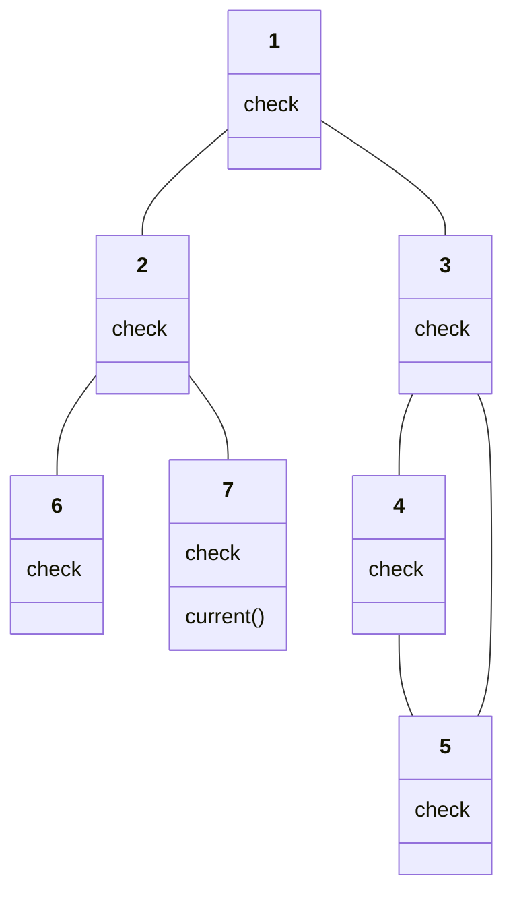
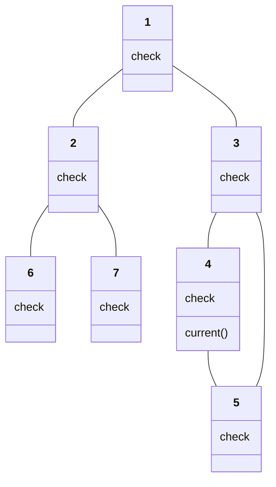

# BFS(Breadth-First Search)

## BFS 특징

* 너비 우선 탐색
* 가까운 노드부터 탐색하는 알고리즘
* 큐 자료구조를 이용하는 것이 정석

### BFS의 동작 과정

인접한 노드를 반복적으로 큐에 넣도록 알고리즘을 작성한다. 먼저 들어온 것이 먼저 나가기 때문에 가까운 노드부터 탐색을 진행한다.

1. 탐색 시작 노드를 큐에 삽입하여 방문 처리
2. 큐에서 노드를 꺼내 해당 노드의 인접 노드 중 방문하지 않은 노드를 모드 큐에 사입하여 방문처리
3. 2번의 과정을 더 이상 수행할 수 없을때 까지 반복

> DFS와 마찬가지로 가장 숫자가 작은 노드부터 먼저 삽입한다고 가정한다.

```txt
1. 시작 노드 Push(1)
```



```txt
2-1. 인접 노드 2,3을 작은 순서대로 Push(2), Push(3)
2-2. 큐에서 노드1 Pop(), 다음 노드 2로 이동
[-][2][3]
```



```txt
3-1. 인접 노드 6,7을 작은 순서대로 Push(6), Push(7)
3-2. 큐에서 노드2 Pop(), 다음 노드 3으로 이동
[-][-][3][6][7]
```



```txt
4-1. 인접 노드 4,5를 작은 순서대로 Push(4), Push(5)
4-2. 큐에서 노드3 Pop(), 다음 노드 6으로 이동
[-][-][-][6][7][4][5]
```



```txt
5. 6에 인접 노드가 없으므로 Pop(), 다음 노드 7로 이동
[-][-][-][-][7][4][5]
```



```txt
6. 7에 인접 노드가 없으므로 Pop(), 다음 노드 4로 이동
[-][-][-][-][-][4][5]
```



```txt
7. 4에 방문하지 않은 노드가 없으므로 Pop(), 다음 노드 5로 이동
[-][-][-][-][-][-][5]
```


```txt
7. 5에 방문하지 않은 노드가 없으므로 Pop()
[-][-][-][-][-][-][-]
```


`탐색 순서: 1->2->3->6->7->4->5`

> 너비 우선 탐색 알고리즘인 BFS는 큐 자료구조에 기초한다. 탐색을 수행함에 있어 O(N)의 시간이 소요되면 일반적으로 수행시간이 DFS보다 좋은 편이다. 코딩 테스트에서는 보통 DFS보다 BFS 구현이 조금 빠르게 동작한다.
