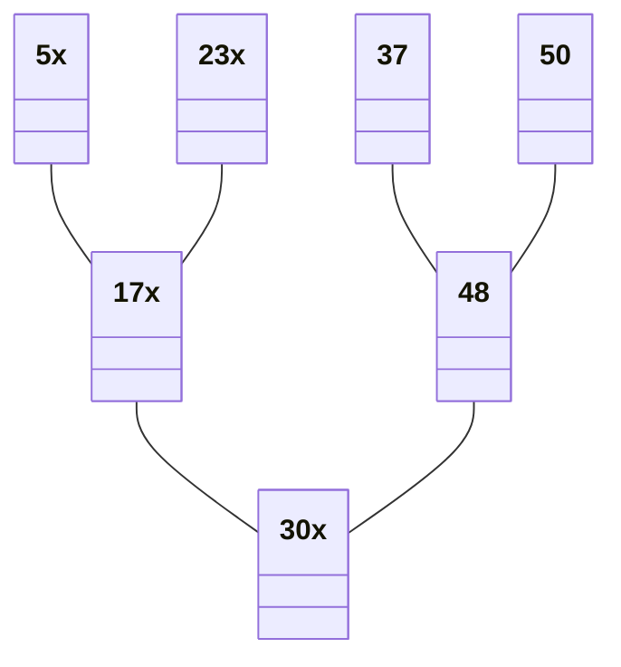
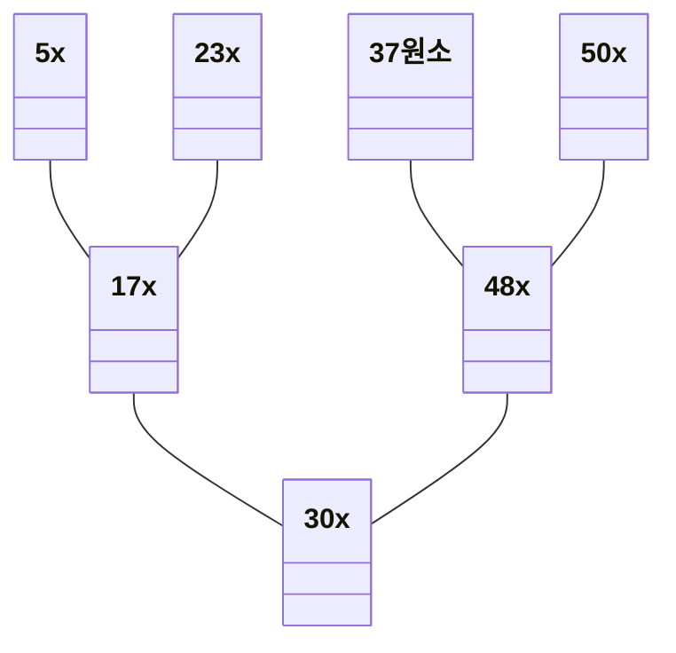

# 이진 탐색(Binary Search)

## 순차 탐색(Sequential Search)

이진 탐색을 이해하기 위해선 가장 기본 탐색 방법인 순차 탐색에 대해 먼저 이해할 필요가 있다.

* 리스트 안에 있는 특정한 데이터를 찾기 위해 앞에서부터 하나씩 차례대로 확인
* 보통 정렬되지 않은 리스트에서 데이터를 찾아야 할 때 사용
* 시간만 충분하다면 항상 원하는 데이터를 찾을 수 있음
* 시간복잡도 = O(N)

### 이진 탐색 : 반으로 쪼개면서 탐색하기

* 이진 탐색은 배열 내부의 데이터가 정렬되어 있어야 사용할 수 있음
* 탐색 범위를 절반씩 좁혀가며 데이터를 탐색함
* 시작점, 끝점, 중간점 변수 3개를 사용함
* 찾으려는 데이터와 중감점 데이터를 반복적으로 비교함
* 연산 횟수 = O(logN)
* 재귀함수 or 반복문을 이용하여 구현

```txt
* 8개의 데이터 중 값이 4인 원소를 찾는 예시

1. 시작점과 끝점 확인 후 중간점을 지정
[*0] [2][4][6] [*8] [10][12][14][16] [*18]
- 중간점 4.5에서 소수점 이하를 버려 [4]로 지정
- 시작점[0] / 중간점[4] / 끝점[9]
- 중간점[4] = 8과 찾으려는 데이터 4를 비교함
- 중간점 데이터가 더 크므로 끝점을 중간점 이전인 [3]로 이동

2. 시작점[0] / 중간점[1] / 끝점[3] 
[*0] [*2] [4] [*6] [8][10][12][14][16][18]
- 중간점 1.5에서 소수점 이하를 버려 [1]로 지정
- 중간점[1]이 4보다 작으므로 모두 버리고 시작점을 [2]로 변경

3. 시작점,중간점[2] / 끝점[3]
[0][2] [**4] [*6] [8][10][12][14]
- 중간점 2.5소수점 이하를 버려 [2]로 지정
- 중간점에 위치한 데이터가 4이므로 탐색 종료
```

### 코딩 테스트에서의 이진 탐색

* 제대로 이진 탐색을 구현하기는 까다로움
* 자주 나오는 문제이니 외우는 것을 권장함
* 이진 탐색의 원리는 다른 알고리즘에서도 폭넓게 적용됨
* 탐색 범위가 큰 상황에서 가정하는 문제가 많음
* 탐색 범위가 2,000만을 넘는 경우 이진 탐색 적용 권장

### 트리 자료구조

* 노드와 노드의 연결로 표현
* 노드 = 정보의 단위, 정보를 가지고 있는 개체
* 그래프 자료구조의 일종
* 데이터베이스, 파일 시스템 등에서 많은 양의 데이터를 관리하기 위한 목적으로 사용
* 트리 자료구조 특징
  * 부모 노드와 자식 노드의 관계로 표현
  * 트리 최상단 노드 = 루트 노드
  * 트리 최하단 노드 = 단말 노드
  * 트리에서 이루를 떼어는 구조 = 서브 트리
  * 계층적이고 정렬된 데이터를 다루기에 적합

### 이진 탐색 트리

* 트리 자료구조 중 가장 간단한 형태
* 이진 탐색이 동장되도록 고안 된 효율적인 탐색 자료구조
* 이진 탐색 트리의 특징
  * 부모 노드보다 왼쪽 자식 노드가 작음
  * 부모 노드보다 오른쪽 자식 노드가 큼
* 왼쪽 자식 노드 < 부모 노드 오른쪽 자식 노드가 성립해야함

`원소값 '37'을 찾는 과정`

* 부모 노드와 찾는 원소값 '37' 비교
* 원소값이 더 크므로 부모 노드와 왼쪽 자식 노드 제외



* 오른쪽 노드에서 48이 부모노드가 됨
* 원소값이 더 작으므로 부모 노드와 오른쪽 자식노드 제외
* 37 방문 - 탐색 종료


