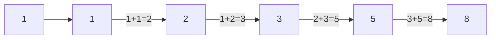
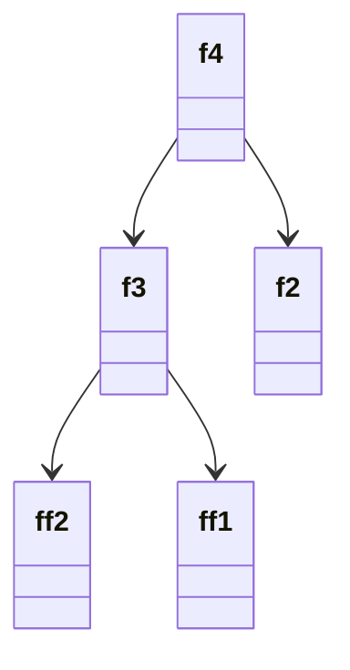

# Dynamic Programming

## 중복되는 연산 줄이기

`최적의 해를 구하기 위해 시간이나 메모리 공간이 매우 많이 필요한 문제 등은 해결하기 어려운 문제이다.`

* 컴퓨터의 연산 속도 한계
* 메모리 공간을 사용할 수 있는 데이터의 계수도 한정적
* 다이나믹 프로그래밍은 메모리 공간을 조금 더 사용하면서 연산 속도를 비약적으로 증가시킬 수 있는 방법
* 동적 계획법이라 표현하기도 함
* Top down / Bottom up / 메모이제이션 기법

### 피보나치 수열

* 이전 두 항의 하을 현재의 항으로 설정하는 특징의 수열



* 점화식
  * 인접한 사이의 관계식
  * 수열 {a𝗻}이 있을 때 각 항을 a𝗻이라 가정
  * a𝗻 = a𝗻-1 + a𝗻+2, a1 = 1, a2 = 1
    * n번째 피보나치 수 = (n-1)번째 피보나치수 + (n-2)번째 피보나치 수
    * 단, 1번째 비보나치수 = 1, 2번째 피보나치수 = 1
* 프로그래밍에선 `배열`이나 `리스트`로 표현



```python
# n번째 피보나치 수 = f(n)
# 4번째 피보나치수 구하시오
# 반복해서 f호출
# 2와 1은 항상 1이므로 호출 정지
# 재귀함수로 구현
def fibo(x):
  if x == 1 or x == 2:
    return 1
  return fibo(x - 1) + fibo(x - 2)

print(fibo(4)) # 3출력
```

* 재귀 함수 호출의 문제점
  * f(n)에서 n이 커질수록 수행시간이 가하급수적으로 늘어남
  * 다이나믹 프로그래밍으로 해결 가능
* 다이나믹 프로그래밍의 사용조건
  * 큰 문제를 작은 문제로 나눌 수 있음
  * 작은 문제에서 구한 정답은 그것을 포함한 큰 문제에서도 동일
* 메모이제이션 기법
  * 다이나믹 프로그래밍 구현 방법 중 하나의 종류
  * 한 번 구한 결과를 메모리에 저장하고 같은 식을 다시 호출 할 때 그대로 가져오는 기법
  * 메모이제이션 값 저장하는 방법 = 캐싱(Caching)

### 다이나믹 프로그래밍 해결 방식

* 큰 문제를 작게 나눔
* 같은 문제는 1회만 연산
* 분할 정복과의 차이점은 다이나믹 프로그래밍은 문제들이 서로 영향을 미친다는 것
  * 한번 해결했던 문제를 다시 해결함
  * 이미 해결 된 문제를 메모리에 저장해 두고 확인하는 작업을 거침
* 시간복잡도 = O(N)
* 재귀함수에서 오버헤드가 발생할 수 있음
* 일반적으로 반복문을 사용하는 다이나믹 프로그래밍이 성능이 더 좋음
* 재귀함수 -> 탑다운(하향식), 반복문 -> 바텀업(상향식)
* 전형적인 형태는 바텀업
* 메모제이션은 탑다운에 국한되어 사용하는 표현

`주어진 문제가 다이나믹 프로그래밍 유형임을 파악하는 것이 중요하다.`

### [example1](https://github.com/jhk-im/algorithm-collection/tree/main/ndb/06_dynamic_programming/example1)
