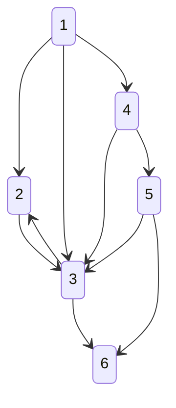
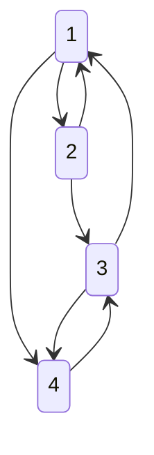

# Shortest Path

## 가장 빠르게 도달하는 방법

* 최단 경로는 가장 짧은 경로를 찾는 알고리즘
* '길 찾기'문제로도 불려짐
* 다양한 사례에 맞는 알고리즘을 선택하여 해결
* 일반적으로 그래프를 이용해서 표현함
* 각 지점은 노드, 연결된 도로는 간선
* 그리디, 다이나믹 프로그래밍 알고리즘이 최단경로 알고리즘에 그대로 적용됨

### 다익스트라(Dijkstra) - 데이크스트라

그래프에 여러 개의 노드가 있을 때 특정한 노드에서 추랄하여 다른 노드로 가는 각각의 최단 경로를 구해주는 알고리즘이다.

* 음의 간선이 엇을 때 정상적으로 동작함
  * 음의 간선 -> 0보다 작은 값을 가지는 간선
* 그리디 알고리즘으로 분류됨
  * 가장 비용이 적은 노드를 선택하여 과정을 반복하기 때문
* 원리
  * 1. 출발 노드 설정
  * 2. 최단 거리 테이블 초기화
  * 3. 방문하지 않은 노드 중에서 최단 거리가 가장 짧은 노드 선택
  * 4. 해동 노드를 거쳐 다른 노드로 가는 비용을 계산하여 최단 거리 테이블 갱신
  * 5. 3번, 4번의 과정을 반복
* 각 노드에 대한 현재까지의 최단거리 정보를 1차원 리스트에 저장하여 계속 갱신
* 4번 과정을 수행한다는 점에서 그리디 알고리즘으로 분류됨
* 구현방법
  * 구현하기 쉽지만 느리게 동작하는 코드
  * 구현하기 까다롭지만 빠르게 동작하는 코드

---

### [example1](https://github.com/jhk-im/algorithm-collection/tree/main/ndb/07_shortest_path/example1)

`1번 노드에서 다른 모든 노드로 가는 최단 경로`



```txt
(1) -- 2 --> (2)
(1) -- 5 --> (3)
(1) -- 1 --> (4)
(2) -- 3 --> (3)
(2) -- 2 --> (4)
(3) -- 3 --> (2)
(3) -- 5 --> (6)
(4) -- 3 --> (3)
(4) -- 1 --> (5)
(5) -- 1 --> (3)
(5) -- 2 --> (6)
````

```txt
1.
* 노드 1, 2, 3, 4, 5, 6
* 출발노드 1
* 다른 모든 노드로 가는 최단 거리를 987,654,321로 초기화
* 먼저 방문하지 않은 노드중 최단 거리가 가장 짧은 노드 선택
* 1번의 최소 비용 => 0
```

|1|2|3|4|5|6|
|-|-|-|-|-|-|
|0|무한|무한|무한|무한|무한|

```txt
2.
* 1번 노드를 거쳐 갈 수 있는 노드 -> 2, 3, 4
* 1번 노드를 거쳐 다른 노드로 가는 비용 계산
* 1번 노드와 연결된 모든 간선을 하나씩 확인
* 2번의 최소 비용 => 0 + 2 = 2
* 3번의 최소 비용 => 0 + 5 = 5
* 4번의 최소 비용 => 0 + 1 = 1
* 각각 무한으로 되어있고 최단 경로를 찾았으므로 갱신함
```

|1|2|3|4|5|6|
|-|-|-|-|-|-|
|0|2|5|1|무한|무한|

```txt
3.
* 이후 모든 단계에서 방문하지 않은 노드의 최단 거리를 선택해야함
* 4번 노드가 1이므로 선택
* 4번 노드를 거쳐서 갈 수 있는 노드 -> 3, 5
* 3번의 최소비용 => 1 + 3 = 4
  * 5 -> 4로 변경
* 5번의 최소 비용 => 1 + 1 = 2
```

|*1|2|3|4|5|6|
|-|-|-|-|-|-|
|0|2|4|1|2|무한|

```txt
4. 
* 2번과 5번 노드가 2로 같을 때에는 일반적으로 작은 노드 선택
* 2번 노드가 거쳐갈 수 있는 노드 -> 3, 4
* 3번의 최소 비용 => 2 + 3 = 5
  * 4 유지
* 4번의 최소 비용 => 2 + 2 = 4
 * 1 유지
```

|*1|2|3|*4|5|6|
|-|-|-|-|-|-|
|0|2|4|1|2|무한|

```txt
5.
* 5번의 노드가 거쳐갈 수 있는 노드 -> 3, 6
* 3번의 최소 비용 = 2 + 1 = 3
  * 4 -> 3으로 변경
* 6번의 최소 비용 = 2 + 2 = 4
```

|*1|*2|3|*4|5|6|
|-|-|-|-|-|-|
|0|2|3|1|2|4|

```txt
6.
* 3번의 노드가 거쳐갈 수 있는 노드 -> 6
* 6번의 최소 비용 = 3 + 5 = 8
  * 4 유지
```

|*1|*2|3|*4|*5|6|
|-|-|-|-|-|-|
|0|2|3|1|2|4|

```txt
6.
* 6번을 거쳐가는 노드 없음
* 결과 -> 23124
```

|*1|*2|3|*4|*5|6|
|-|-|-|-|-|-|
|0|2|3|1|2|4|

`한 단계당 최단 거리를 확실히 찾음`

---

### 간단한 다익스트라 알고리즘

* 시간복잡도 O(V²)
  * 최단 거리를 매번 선형 탐색해야하기 때문
* V는 노드개수
* 각 노드에 대한 최단 거리를 담는 1차원 리스트 선언
* 단계마다 방문하지 않은 노드 중 최단 거리가 가장 짧은 노드 선택
* 단계마다 1차원 리스트의 원소를 순차 탐색
* 노드 개수가 5000개 이하라면 사용 가능

### 개선된 다익스트라 알고리즘

* 최악의 경우 시간복잡도 O(ElogV) 보장
* V = 노드개수, E = 간선개수
* 힙 자료구조 사용
  * 우선순위 큐를 구현하기 위해 사용하는 자료구조
  * 우선순위가 가장 높은 데이터를 가장 먼저 삭제
  * 데이터를 우선순위에 따라 처리하고 싶을 때 사용
  * 대부분 프로그래밍 언어에서 우선순위 큐를 제공함
  * 일반적으로 정수가 사용됨
  * 동작원리
    * 물건 정보 -> (가치, 무게)
    * 모든 물건을 우선순위 큐 자료구조에 넣음
    * 물건을 꺼낼 때 가치가 높은 물건이 먼저 나옴
  * 최소힙 -> 가치가 낮은 데이터 먼저 삭제
  * 최대힙 -> 가치가 큰 데이터 먼저 삭제
  * 최단경로 알고리즘에선 최소히을 사용하는것이 적합
  * 최소힙 사용시 가치값에 음수를 붙여 자주 사용함
    * 꺼낼때 다시 원래 값으로 변경

---

### [example2](https://github.com/jhk-im/algorithm-collection/tree/main/ndb/07_shortest_path/example2)

`현재 가장 가까운 노드를 저장하기 위한 목적으로 우선순위 큐를 사용`


```txt
(1) -- 2 --> (2)
(1) -- 5 --> (3)
(1) -- 1 --> (4)
(2) -- 3 --> (3)
(2) -- 2 --> (4)
(3) -- 3 --> (2)
(3) -- 5 --> (6)
(4) -- 3 --> (3)
(4) -- 1 --> (5)
(5) -- 1 --> (3)
(5) -- 2 --> (6)
````

```txt
* 실제 동작은 기존 다익스트라와 동일
* 우선순위 큐의 동작 확인

1.
* 첫번째 노드(0, 1) 큐에 Push()
```

|1|2|3|4|5|6|
|-|-|-|-|-|-|
|0|무한|무한|무한|무한|무한|

|우선순위 큐|(0, 1)|
|-|-|

```txt
2.
* 큐에서 꺼낸 노드가 아직 처리되지 않은 경우에만 처리함
* 우선순위가 가장 높은 (0, 1)노드를 Pop()하여 비교
* (2, 2), (5, 3), (1, 4)노드를 각각 Push()
* 우선순위에 맞게 정렬됨
```

|1|2|3|4|5|6|
|-|-|-|-|-|-|
|0|2|5|1|무한|무한|

|우선순위 큐|(1, 4) (2, 2) (5, 3)|
|-|-|

```txt
3.
* 우선순위가 가장 높은 (1, 4)노드를 Pop()하여 비교
* (5, 3) Pop() -> (4, 3) Push()
* (2, 5) 노드 Push()
* 우선순위에 맞게 정렬
```

|*1|2|3|4|5|6|
|-|-|-|-|-|-|
|0|2|4|1|2|무한|

|우선순위 큐|(2, 2) (2, 5) (4, 3) (5, 3)|
|-|-|

```txt
4. 
* (2, 2)와 (2, 5)중 낮은 노드인 (2, 2) Pop()하여 비교
* 변경사항 없음
```

|*1|2|3|*4|5|6|
|-|-|-|-|-|-|
|0|2|4|1|2|무한|

|우선순위 큐|(2, 5) (4, 3) (5, 3)|
|-|-|

```txt
5.
* 우선순위가 가장 높은 (2, 5)노드를 Pop()하여 비교
* (4, 3) Pop() -> (3, 3) Push()
```

|*1|*2|3|*4|5|6|
|-|-|-|-|-|-|
|0|2|3|1|2|4|

|우선순위 큐|(3, 3) (4, 6) (5, 3)|
|-|-|

```txt
6.
* 우선순위가 가장 높은 (3, 3)노드를 Pop()하여 비교
```

|*1|*2|3|*4|*5|6|
|-|-|-|-|-|-|
|0|2|3|1|2|4|

|우선순위 큐|(4, 6) (5, 3)|
|-|-|

```txt
6.
* 우선순위가 가장 높은 (4, 6)노드를 Pop()하여 비교
```

|*1|*2|3|*4|*5|6|
|-|-|-|-|-|-|
|0|2|3|1|2|4|

|우선순위 큐|(5, 3)|
|-|-|

```txt
7.
* 우선순위가 가장 높은 (5, 3)노드를 Pop()하여 비교
```

|*1|*2|3|*4|*5|*6|
|-|-|-|-|-|-|
|0|2|3|1|2|4|

|우선순위 큐||
|-|-|

---

### 플로이드 워셜(Floyd-Warshall) 알고리즘

* 모든 지점에서 다른 모든 지점까지의 최단 경로를 모두 구해야하는 경우 사용
* 단계마다 거처가는 노드를 기준으로 알고리즘 수행
* 방문하지 않은 노드 중 최단 거리를 갖는 노드를 찾을 필요 없음
* 노드 개수 N -> 알고리즘 상으로 N번의 단계 수행 -> 단계마다 O(N²) 연산 -> 현재 거쳐가는 모든 경로 고려
* 시간 복잡도 O(N³)
* 2차원 리스트에 최단거리 저장 -> 매번 O(N²) 시간소요
* 다이나믹 프로그래밍
* 점화식 -> Dab = min(Dab, Dak + Dkb)
  * a에서 b로 가는 최소비용과 a에서 k를 거쳐 b로 가는 비용을 비교하여 더 작은 값으로 갱신
* 전체적으로 3중 반복문 이용

### [example3](https://github.com/jhk-im/algorithm-collection/tree/main/ndb/07_shortest_path/example3)



```txt
1.
1 --> 2 = 4
1 --> 4 = 6
2 --> 1 = 3
2 --> 3 = 7
3 --> 1 = 5
3 --> 4 = 4
4 --> 3 = 2
```

|출발\도착|1번|2번|3번|4번|
|-|-|-|-|-|
|1번|0|4|INF|6|
|2번|3|0|7|INF|
|3번|5|INF|0|4|
|4번|INF|INF|0|0|

```txt
2.
* 1번 노드를 거쳐 가는 경우 고려
* D23 = min(D23, D21 + D13)
  * 7 = min(7, 3 + INF)
* D24 = min(D24, D21 + D14)
  * 9 = min(INF, 3 + 6)
* D32 = min(D32, D31 + D12)
  * 9 = min(INF, 5 + 4) 
* D34 = min(D34, D31 + D14)
  * 4 = min(4, 5 + 4) 
* D42 = min(D42, D41 + D12)
  * INF = min(INF, INF + 4)
* D43 = min(D43, D41 + D13)
  * 2 = min(2, INF + INF)
```

|출발\도착|1번|2번|3번|4번|
|-|-|-|-|-|
|1번|0|4|INF|6|
|2번|3|0|*7|*9|
|3번|5|*9|0|*4|
|4번|INF|*INF|*2|0|

```txt
3.
* 2번 노드를 거쳐 가는 경우 고려
* D13 = min(D13, D12 + D23)
  * 11 = min(INF, 4 + 7)
* D14 = min(D14, D12 + D24)
  * 6 = min(6, 4 + INF)
* D31 = min(D31, D32 + D21)
  * 5 = min(5, INF + 3)
* D34 = min(D34, D32 + D24)
  * 4 = min(4, INF + INF)
* D41 = min(D41, D42 + D21)
  * INF = min(INF, INF + 3)
* D43 = min(D43, D42 + D23)
  * 2 = min(2, INF, INF + 7)
```

|출발\도착|1번|2번|3번|4번|
|-|-|-|-|-|
|1번|0|4|*11|*6|
|2번|3|0|7|9|
|3번|*5|9|0|*4|
|4번|*INF|INF|*2|0|

```txt
4.
* 3번 노드를 거쳐 가는 경우 고려
* D12 = min(D12, D13 + D32)
  * 4 = min(4, 11 + 9)
* D14 = min(D14, D13 + D34)
  * 6 = min(6, 11 + 4)
* D21 = min(D21, D23 + D31)
  * 3 = min(3, 7 + 5)
* D24 = min(D24, D23 + D34)
  * 9 = min(9, 7 + 4)
* D41 = min(D41, D43 + D31)
  * 7 = min(INF, 2 + 5)
* D42 = min(D42, D43 + D32)
  * 11 = min(INF, 2 + 9)
```

|출발\도착|1번|2번|3번|4번|
|-|-|-|-|-|
|1번|0|*4|11|*6|
|2번|*3|0|7|*9|
|3번|5|9|0|4|
|4번|*7|*11|2|0|

```txt
4.
* 4번 노드를 거쳐 가는 경우 고려
* D12 = min(D12, D14 + D42)
  * 4 = min(4, 7 + 11)
* D13 = min(D13, D14 + D43)
  * 8 = min(11, 6 + 2)
* D21 = min(D21, D14 + D41)
  * 3 = min(3, 7 + 7)
* D23 = min(D23, D24 + D43)
  * 7 = min(7, 9 + 2)
* D31 = min(D31, D43 + D31)
  * 5 = min(5, 2 + 5)
* D32 = min(D32, D43 + D32)
  * 9 = min(9, 2 + 9)
```

|출발\도착|1번|2번|3번|4번|
|-|-|-|-|-|
|1번|0|*4|*8|6|
|2번|*3|0|*7|9|
|3번|*5|*9|0|4|
|4번|7|11|2|0|

* 최종결과
* 시간 복잡도 = O(N³)
