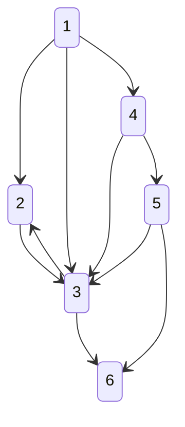

# Shortest Path

## 가장 빠르게 도달하는 방법

* 최단 경로는 가장 짧은 경로를 찾는 알고리즘
* '길 찾기'문제로도 불려짐
* 다양한 사례에 맞는 알고리즘을 선택하여 해결
* 일반적으로 그래프를 이용해서 표현함
* 각 지점은 노드, 연결된 도로는 간선
* 그리디, 다이나믹 프로그래밍 알고리즘이 최단경로 알고리즘에 그대로 적용됨

### 다익스트라(Dijkstra) - 데이크스트라

그래프에 여러 개의 노드가 있을 때 특정한 노드에서 추랄하여 다른 노드로 가는 각각의 최단 경로를 구해주는 알고리즘이다.

* 음의 간선이 엇을 때 정상적으로 동작함
  * 음의 간선 -> 0보다 작은 값을 가지는 간선
* 그리디 알고리즘으로 분류됨
  * 가장 비용이 적은 노드를 선택하여 과정을 반복하기 때문
* 원리
  * 1. 출발 노드 설정
  * 2. 최단 거리 테이블 초기화
  * 3. 방문하지 않은 노드 중에서 최단 거리가 가장 짧은 노드 선택
  * 4. 해동 노드를 거쳐 다른 노드로 가는 비용을 계산하여 최단 거리 테이블 갱신
  * 5. 3번, 4번의 과정을 반복
* 각 노드에 대한 현재까지의 최단거리 정보를 1차원 리스트에 저장하여 계속 갱신
* 4번 과정을 수행한다는 점에서 그리디 알고리즘으로 분류됨
* 구현방법
  * 구현하기 쉽지만 느리게 동작하는 코드
  * 구현하기 까다롭지만 빠르게 동작하는 코드

---

`1번 노드에서 다른 모든 노드로 가는 최단 경로`



```txt
(1) -- 2 --> (2)
(1) -- 5 --> (3)
(1) -- 1 --> (4)
(2) -- 3 --> (3)
(2) -- 2 --> (4)
(3) -- 3 --> (2)
(3) -- 5 --> (6)
(4) -- 3 --> (3)
(4) -- 1 --> (5)
(5) -- 1 --> (3)
(5) -- 2 --> (6)
````

```txt
1.
* 노드 1, 2, 3, 4, 5, 6
* 출발노드 1
* 다른 모든 노드로 가는 최단 거리를 987,654,321로 초기화
* 먼저 방문하지 않은 노드중 최단 거리가 가장 짧은 노드 선택
* 1번의 최소 비용 => 0
```

|1|2|3|4|5|6|
|-|-|-|-|-|-|
|0|무한|무한|무한|무한|무한|

```txt
2.
* 1번 노드를 거쳐 갈 수 있는 노드 -> 2, 3, 4
* 1번 노드를 거쳐 다른 노드로 가는 비용 계산
* 1번 노드와 연결된 모든 간선을 하나씩 확인
* 2번의 최소 비용 => 0 + 2 = 2
* 3번의 최소 비용 => 0 + 5 = 5
* 4번의 최소 비용 => 0 + 1 = 1
* 각각 무한으로 되어있고 최단 경로를 찾았으므로 갱신함
```

|1|2|3|4|5|6|
|-|-|-|-|-|-|
|0|2|5|1|무한|무한|

```txt
3.
* 이후 모든 단계에서 방문하지 않은 노드의 최단 거리를 선택해야함
* 4번 노드가 1이므로 선택
* 4번 노드를 거쳐서 갈 수 있는 노드 -> 3, 5
* 3번의 최소비용 => 1 + 3 = 4
  * 5 -> 4로 변경
* 5번의 최소 비용 => 1 + 1 = 2
```

|*1|2|3|4|5|6|
|-|-|-|-|-|-|
|0|2|4|1|2|무한|

```txt
4. 
* 2번과 5번 노드가 2로 같을 때에는 일반적으로 작은 노드 선택
* 2번 노드가 거쳐갈 수 있는 노드 -> 3, 4
* 3번의 최소 비용 => 2 + 3 = 5
  * 4 유지
* 4번의 최소 비용 => 2 + 2 = 4
 * 1 유지
```

|*1|2|3|*4|5|6|
|-|-|-|-|-|-|
|0|2|4|1|2|무한|

```txt
5.
* 5번의 노드가 거쳐갈 수 있는 노드 -> 3, 6
* 3번의 최소 비용 = 2 + 1 = 3
  * 4 -> 3으로 변경
* 6번의 최소 비용 = 2 + 2 = 4
```

|*1|*2|3|*4|5|6|
|-|-|-|-|-|-|
|0|2|3|1|2|4|

```txt
6.
* 3번의 노드가 거쳐갈 수 있는 노드 -> 6
* 6번의 최소 비용 = 3 + 5 = 8
  * 4 유지
```

|*1|*2|3|*4|*5|6|
|-|-|-|-|-|-|
|0|2|3|1|2|4|

```txt
6.
* 6번을 거쳐가는 노드 없음
* 결과 -> 23124
```

|*1|*2|3|*4|*5|6|
|-|-|-|-|-|-|
|0|2|3|1|2|4|

`한 단계당 최단 거리를 확실히 찾음`

### 간단한 다익스트라 알고리즘

* 시간복잡도 O(V²)
* V는 노드개수
* 각 노드에 대한 최단 거리를 담는 1차원 리스트 선언
* 단계마다 방문하지 않은 노드 중 최단 거리가 가장 짧은 노드 선택
* 단계마다 1차원 리스트의 원소를 순차 탐색
