# Graph

## 그래프 이론

* 노드와 노드 사이 연결된 간선의 정보를 가지고 있는 자료구조
* 알고리즘 문제에서 '서로 다른 객체가 연결되어 있다'는 의미가 보이면 그래프 알고리즘을 의심해 보아야 함
* 그래프 자료구조 중 트리 자료구조는 다양한 알고리즘에 사용됨
  * 트리 자료구조는 부모에서 자식으로 내려오는 계층적인 모델에 속함
  * 최소 힙은 항상 부모 노드가 자식 노드보다 크기가 작은 자료구조로 트리 자료구조에 속함

| |그래프|트리|
|-|-|-|
|방향성|방향그래프 혹은 무방향 그래프| 방향 그래프|
|순환성|순환 및 비순환|비순환|
|루트 노드|없음|있음|
|노드 관계|없음|부모와 자식 관계|
|모델 종류|네트워크 모델|계층 모델|

* 그래프 구현방법
  * 인접 행렬: 2차원 배열 사용
  * 인접 리스트: 리스트 사용
* 노드 개수 V, 간선 개수 E
  * 인접 행렬
    * 간선 정보 저장을 위해 O(V²) 메모리 공간 필요
    * 특정 노드에서 다른 노드로 이어진 간선 비용을 O(1) 시간으로 즉시 알 수 있음
    * 플로이드 워셜 알고리즘
      * 모든 노드에 대하여 다른 노드로 가는 비용을 V² 크기의 2차원 리스트에 저장
      * 해당 비용을 갱신하여 최단거리 계산
      * 노드의 개수가 적은 경우 이용 가능
  * 인접 리스트
    * 간선 개수만큼인 O(E) 메모리 공간 필요
    * 특정 노드에서 다른 노드로 이어진 간선 비용이 O(V)만큼 소요됨
    * 다익스트라 최단 경로 알고리즘
      * 노드 개수가 V개일 때 V개의 리스트를 만들어 모든 간선 정보를 리스트에 저장
      * 노드, 간선의 개수가 모두 많은경우 사용하면 유리함

---

### 서로소 집합(Disjoint Sets)

* 공통 원소가 없는 두 집합을 의미함
  * 집합 {1, 2}와 {3, 4}는 서로소 관계
  * 집합 {1, 2}와 {2, 3}은 서로소 관계가 아님
* 서로소 집합 자료구조
  * 서로소 부분 집합들로 나누어진 원소들의 데이터를 처리하기 위한 자료구조
* union-find 자료구조로 불리기도 함
  * union(합집합) 연산
    * 2개의 원소가 포함된 집합을 하나의 집합으로 합침
  * find(찾기) 연산
    * 특정한 원소가 속한 지합이 어떤 집합인지 알려주는 연산
  * 스택과 큐에서 Push, Pop으로 구성된 것과 비슷함

### 서로소 집합 자료구조

* 트리 자료구조를 이용하여 집합 표현
  * union 연산을 확인하여 서로 연결된 두 노드 A, B를 확인함
    * A, B의 루트 노드 A',B' 를 찾고 부모 노드로 지정
    * B'가 A'를 가리키도록 함 (가리킨다 = 부모노드로 설정)
      * 일반적으로 A'와 B'중 더 작은 원소가 부모 노드가 되도록 구현
  * 모든 union 연산을 처리할 때까지 반복

`예시 - exaple1`

* 전체 집합 {1, 2, 3, 4, 5, 6}
* union 연산
  * {1, 4} / {2, 3} / {2, 4} / {5, 6}

```txt
1. 
* 노드 개수 크기의 부모 테이블 초기화
* 모든 원소가 자기 자신을 부모로 가지도록 설정
* 재귀적으로 부모를 거슬러 올라가 최종적인 루트 노드를 찾음
```

|노드 번호|1|2|3|4|5|6|
|-|-|-|-|-|-|-|
|부모|1|2|3|4|5|6|

```txt
2.
* union {1, 4}
* 노드 1과 4의 부모노드 설정
* 더 큰 번호에 해당하는 노드4의 부모를 1로 설정
```

|노드 번호|1|2|3|4|5|6|
|-|-|-|-|-|-|-|
|부모|1|2|3|1|5|6|

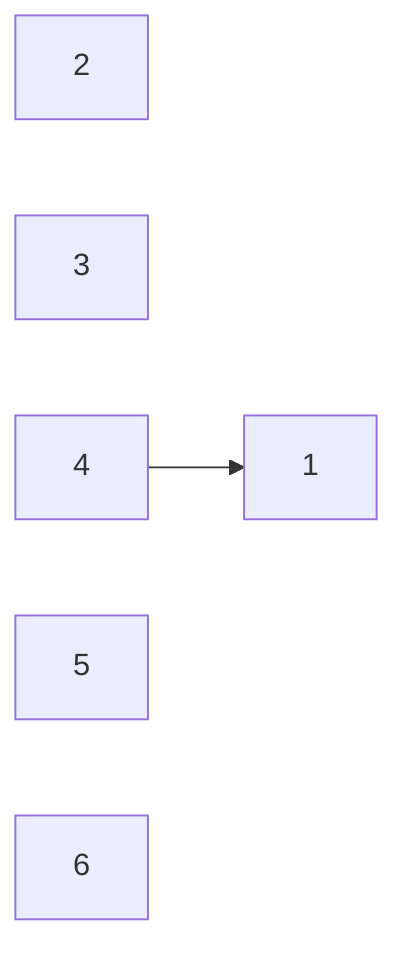

```txt
2.
* union {2, 3}
* 노드 2과 3의 부모노드 설정
* 더 큰 번호에 해당하는 노드3의 부모를 2로 설정
```

|노드 번호|1|2|3|4|5|6|
|-|-|-|-|-|-|-|
|부모|1|2|2|1|5|6|

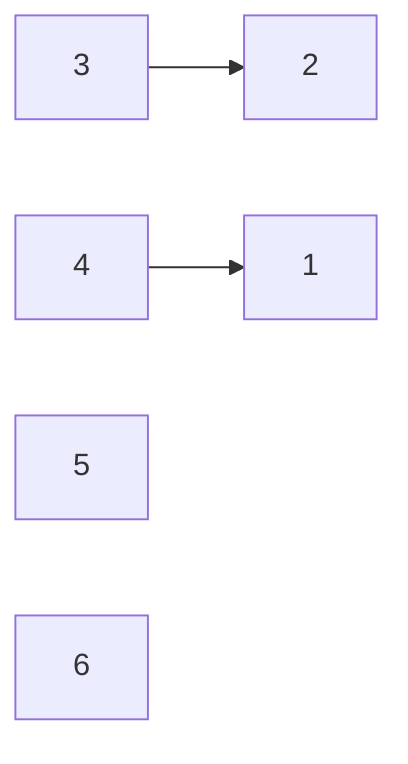

```txt
3.
* union {2, 4}
* 노드 2과 4의 부모노드 설정
* 2(2)와 4(1)노드 중 2의 루트노드가 더 큼
* 2의 부노드를 1로 설정
```

|노드 번호|1|2|3|4|5|6|
|-|-|-|-|-|-|-|
|부모|1|1|2|1|5|6|

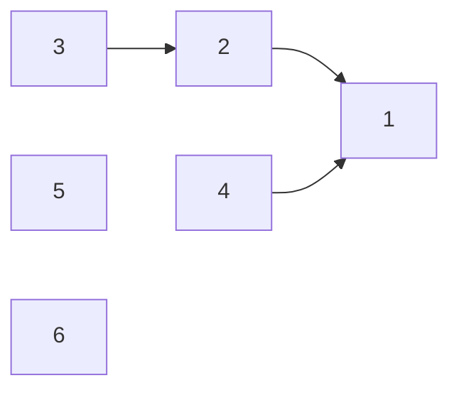

```txt
4.
* union {5, 6}
* 노드 5과 6의 부모노드 설정
* 더 큰 번호에 해당하는 노드6의 부모를 5로 설정
```

|노드 번호|1|2|3|4|5|6|
|-|-|-|-|-|-|-|
|부모|1|1|2|1|5|5|

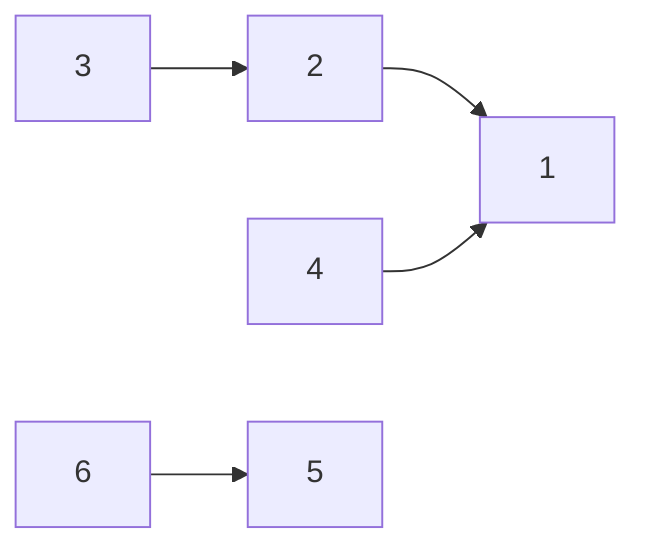

* union 연산을 효과적으로 수행하기 위해 부모 테이블을 가지고 있어야 함
* 루트 노드를 즉시 계산할 수 없고 부모테이블에서 계속 확인하여 거슬러 올라가야 함
* `서로소 집합 알고리즘`은 루트를 찾기 위해 재귀적으로 부모를 거슬러 올라감

`find의 시간복잡도 O(V)` 해결법

* {1, 2, 3, 4, 5}
* 모두 같은 집합에 속하는 경우
  * {4, 5} / {3, 4} / {2, 3} / {1, 2}
* 모든 원소의 루트 노드가 1
* 5의 루트를 찾기위해 5 -> 4 -> 3 -> 2 -> 1 순서로 거슬러 올라가야 함
  * 최대 시간복잡도 = O(V)
* 전체 시간복잡도 = O(VM)
* `경로 압축(Path Compression) 기법`을 사용하여 해결
  * 해당 노드의 루트 노드가 부모 노드가 됨
  * 기존 부모 테이블 {1, 1, 2, 1, 5, 5}
  * 경로 압출 부모 테이블 {1, 1, 1, 1, 5, 5}
* 코딩 테스트 수준에선 경로 압축만 적용해도 충분함

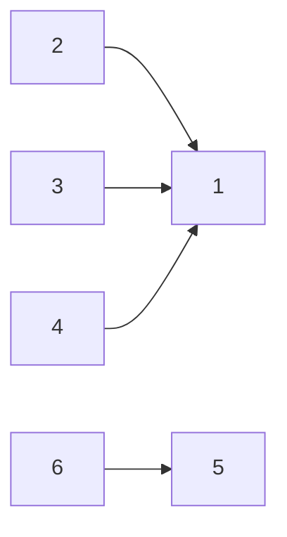

### 서로소 집합을 활용한 사이클 판별

* union 연산 = 그래프의 간선
* 간선을 하나씩 확인하여 두 노드가 포함되어 있는 집합을 합치는 과정 반복
* 알고리즘
  * 각 간선을 확인하며 두 노드의 루트 노드 확인
    * 루트 노드가 서로 다르면 두 노드에 대하여 union 연산 수행
    * 루트 노드가 서로 같다면 사이클 발생
  * 모든 간선에 대하여 과정 반복

`예시 - exaple2`

```txt
1.
* 자기 자신을 부모로 설정하여 부모 테이블 초기화
```

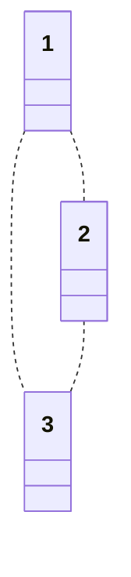

|인덱스|1|2|3|
|-|-|-|-|
|부모|1|2|3|

```txt
2.
* 간선 (1, 2) 확인
* 간선 2의 부모 노드가 더 크므로 1로 변경
```

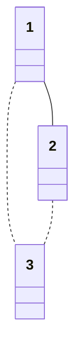

|인덱스|1|2|3|
|-|-|-|-|
|부모|1|1|3|

```txt
3.
* 간선 (1, 3) 확인
* 간선 3의 부모 노드가 더 크므로 1로 변경
```

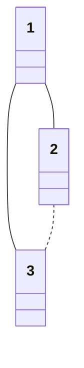

|인덱스|1|2|3|
|-|-|-|-|
|부모|1|1|1|

```txt
3.
* 간선 (2, 3) 확인
* 모두 부모 노드가 1이므로 사이클 발생
```

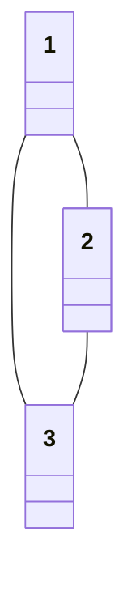

---

### 신장 트리(Spanning Tree)

* 하나의 그래프가 있을 때 모든 노드를 포함하면서 사이클이 존재하지 않는 부분 그래프
* 모든 노드가 연결되어 있으면서 사이클이 존재하지 않아야함

### 크루스칼(Kruskal) 알고리즘

* 대표적인 최소 신장 트리 알고리즘
* 가장 적은 비용으로 모든 노드를 연결
* 그리디 알고리즘으로 분류됨
* 모든 간선 정렬 수행 후 짧은 간선부터 집합에 포함
* 사이클이 발생하는 간선은 집합에 포함하지 않음
* 알고리즘
  * 간선 데이터를 비용에 따라 오름차순으로 정렬
  * 간선을 하나씩 확인하며 현재의 간선이 사이클 발생하는지 확인
    * 사이클이 발생하는 경우만 최소 신장트리에 포함
  * 과정 반복

`예시 - exaple3`

```txt
1.
* 그래프의 모든 간선 정보를 빼내어 정렬 수행
```

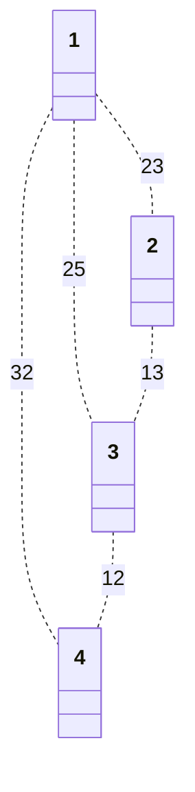

|간선|(1, 2)|(1, 3)|(1, 4)|(2, 3)|(3, 4)|
|-|-|-|-|-|-|
|비용|23|25|32|13|12|

```txt
2.
* 가장 짧은 간선을 선택 --> (3, 4)
  * 3과 4에 대하여 union 실행
* 3과 4는 같은 집합에 속해있지 않으므로 집합에 포함
```


|간선|(1, 2)|(1, 3)|(1, 4)|(2, 3)|(3, 4)|
|-|-|-|-|-|-|
|비용|23|25|32|13|12|
|순서|||||1|

```txt
3.
* 다음으로 가장 짧은 간선을 선택 --> (2, 3)
  * 2과 3에 대하여 union 실행
* 2와 3은 같은 집합에 속해있지 않으므로 집합에 포함
```

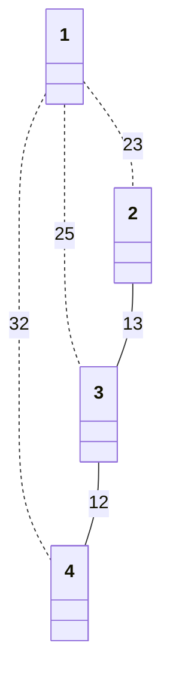

|간선|(1, 2)|(1, 3)|(1, 4)|(2, 3)|(3, 4)|
|-|-|-|-|-|-|
|비용|23|25|32|13|12|
|순서||||2|1|

```txt
4.
* 다음으로 가장 짧은 간선을 선택 --> (1, 2)
  * 1과 2에 대하여 union 실행
* 1과 2는 같은 집합에 속해있지 않으므로 집합에 포함
```

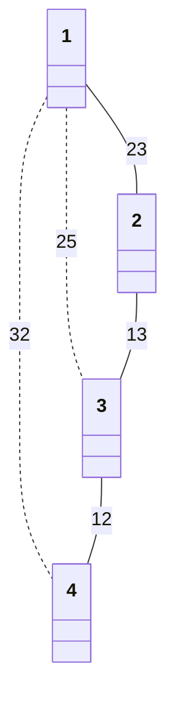

|간선|(1, 2)|(1, 3)|(1, 4)|(2, 3)|(3, 4)|
|-|-|-|-|-|-|
|비용|23|25|32|13|12|
|순서|3|||2|1|

```txt
5.
* 다음으로 가장 짧은 간선을 선택 --> (1, 3)
* 1과 3은 같은 집합
* union 실행하지 않음
```


|간선|(1, 2)|(1, 3)|(1, 4)|(2, 3)|(3, 4)|
|-|-|-|-|-|-|
|비용|23|25|32|13|12|
|순서|3|//4||2|1|

```txt
6.
* 다음으로 가장 짧은 간선을 선택 --> (1, 4)
* 1과 4는 같은 집합
* union 실행하지 않음
```


|간선|(1, 2)|(1, 3)|(1, 4)|(2, 3)|(3, 4)|
|-|-|-|-|-|-|
|비용|23|25|32|13|12|
|순서|3|//4|//5|2|1|

* 최소 신장트리의 간선비용을 모두 더하여 최종 비용을 구함
* 정답 : 48
* 시간복잡도
  * 간선의 개수 = E
  * O(ElogE) = 간선 정렬
    * 가장 시간이 오래 걸리는 부분은 간선을 정렬하는 부분임

`/exaple3`

---
