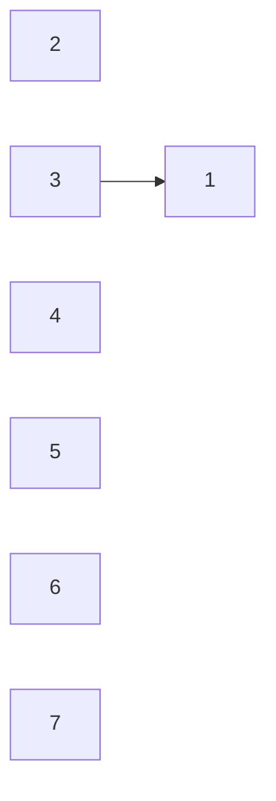
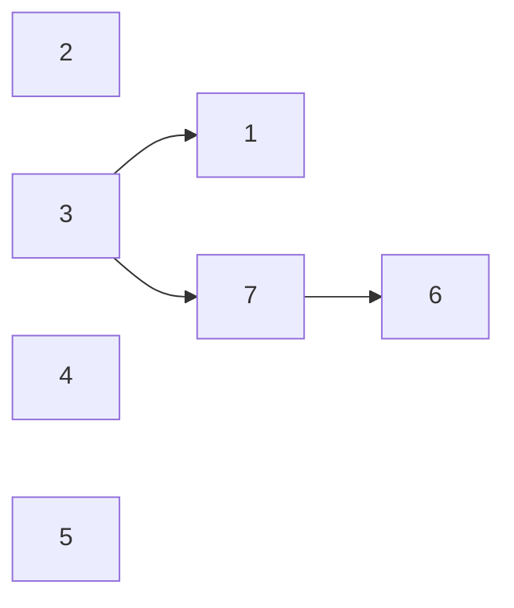
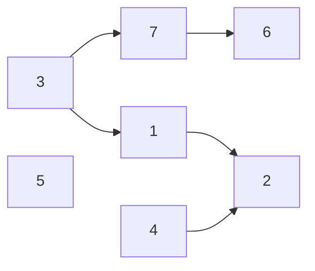

# 팀 결성

## 문제 설명

* 학생들에게 0번 부터 N번까지의 번호 부여
* 학생들은 서로 다른팀으로 구분됨
* N + 1개의 팀 존재
* 팀 합치기 연산
  * 두 팀을 확인
  * 같은 팀 여부 확인
* M개의 연산을 수행할 수 있음

`같은팀여부확인 연산에 대한 결과를 출력하시오`

입력 조건

* 첫째 줄에 N과 M이 주어짐(1 <= N,M <= 100,000)
* 다음 줄 부터 각각의 연산이 주어짐
* 팀 합치기 연산
  * 0 a b
  * a번 학생이 속한 팀과 b번 학생이 속한 팀을 합침
* 같은 팀 여부 확인 연산
  * 1 a b
  * a, b번 학생이 같은 팀에 속해있는지를 확인하는 연산
* a, b는 N이하의 양의 정수

```txt
7 8
0 1 3
1 1 7
0 7 6
1 7 1
0 3 7
0 4 2
0 1 1
1 1 1
```

출력 조건

* 같은 팀 여부 확인 연산에 대하여 YES 혹은 NO로 결과를 출력함

```txt
NO
NO
YES
```

### 해결 과정

* 전형적인 서로소 집합 알고리즘 문제
* N과 M 범위가 최대 100,000이하
* 경로 압축 방식의 서로소 집합 자료구조 사용

```txt
1.
입력
7 8
* 노드 개수 크기의 부모 테이블 초기화
* 모든 원소가 자기 자신을 부모로 가지도록 설정
* 재귀적으로 부모를 거슬러 올라가 최종적인 루트 노드를 찾음
```

|노드 번호|1|2|3|4|5|6|7|
|-|-|-|-|-|-|-|-|
|부모|1|2|3|4|5|6|7|

```txt
2.
입력
0 1 3
1 1 7
* union {1, 3}
  * 노드 1과 3의 부모노드 설정
  * 노드 3의 부모 = 노드 1의 부모
* 노드 1과 7이 속한 집합을 찾아 같은 집합인지 확인
출력
NO
```

|노드 번호|1|2|3|4|5|6|7|
|-|-|-|-|-|-|-|-|
|부모|1|2|1|4|5|6|7|



```txt
2.
입력
0 7 6
1 7 1
* union {7, 6}
  * 노드 7과 6의 부모노드 설정
  * 노드 7의 부모 = 노드 6의 부모
* 노드 7과 1이 속한 집합을 찾아 같은 집합인지 확인
출력
NO
```

|노드 번호|1|2|3|4|5|6|7|
|-|-|-|-|-|-|-|-|
|부모|1|2|1|4|5|6|6|



```txt
3.
입력
0 3 7
0 4 2
0 1 2
1 6 4
* union {3, 7}
  * 노드 3과 7의 부모노드 설정
  * 노드 7의 부모 = 노드 6
    * 노드 6의 부모 = 노드 3의 부모
* union {4, 2}
  * 노드 4와 2의 부모노드 설정
  * 노드 4의 부모 = 노드 2의 부모
* union {1, 2}
  * 노드 1과 2의 부모노드 설정
  * 노드 2의 부모 = 노드 1의 부모
출력
YES
```

|노드 번호|1|2|3|4|5|6|7|
|-|-|-|-|-|-|-|-|
|부모|1|1|1|2|5|1|6|


