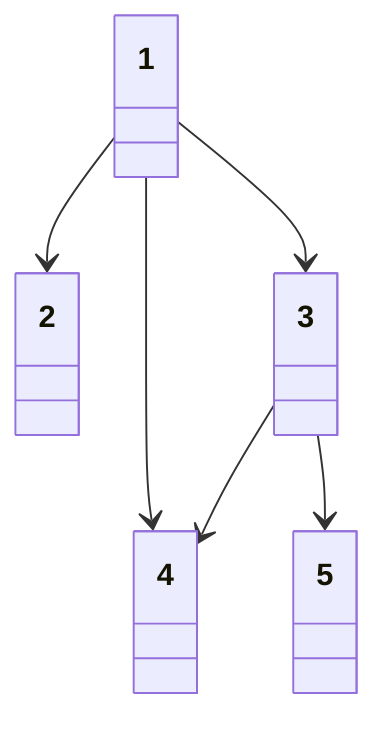
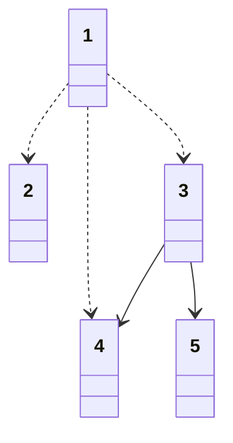
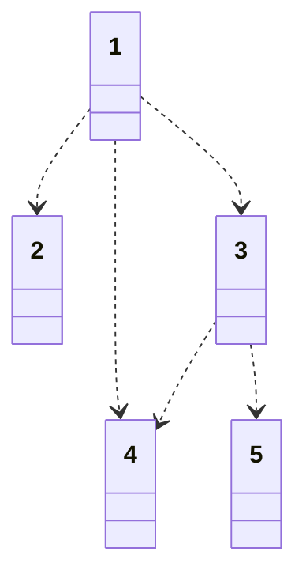

# 커리큘럼

## 문제 설명

* N개의 강의를 들을 수 있음
* 모든 강의는 1부터 N번까지 번호를 가짐
* 모든 강의는 수강시간이 있음
* 동시에 여러개 강의를 들을 수 있음

`N개의 강의 정보가 주어졌을 때, N개의 강의에 대하여 수강하기까지 걸리는 최소시간을 각각 출력하시오`

입력 조건

* 첫째줄에 강의 개수 N이 주어짐(2 <= N <= 500)
* 다음 N개의 줄에 각 강의시간, 강의를 듣기 위해 먼저 들어야 하는 강의 번호가 공백을 포함한 자연수로 주어짐
  * (0 <= 강의시간 <= 100,000)
  * (1 <= 강의번호 <= N)
  * 각 줄은 -1로 끝남

```txt
5
10 -1
10 1 -1
4 1 -1
4 3 1 -1
3 3 -1
```

출력 조건

* N개의 강의에 대하여 수강하기까지 걸리는 최소시간을 한줄에 하나씩 출력

```txt
10
20
14
18
17
```

### 해결 과정

* 정렬 알고리즘 응용 문제
* 인접한 노드에 대하여 현재보다 강의 시간이 더 긴 경우를 찾는 경우
  * 더 오랜 시간이 걸리는 시간 값을 저장하는 방식
  * 결과 테이블을 갱신하여 답을 구함
* 위상 정렬을 수행하면서, 매번 간선 정보를 확인하여 결과테이블 갱신
* 리스트의 경우 단순 대입 연산을 하면 문제가 발생할 수 있음
  * 파이썬에선 deepcopy() 함수를 사용하여 해결

```txt
0.
* 진입 차수가 0인 노드1을 큐에 넣음
```



|강의|1|2|3|4|5|
|-|-|-|-|-|-|
|강의시간|10|10|4|4|3|
|진입차수|0|1|1|2|1|
|최소시간|10|10|4|4|3|

|큐|노드1|
|-|-|

```txt
1.
* 노드1 Pop
* 노드1과 연결된 간선 제거
  * 노드2 진입차수 - 1 = 0 -> Push
    * 최소시간2 = (최소시간2 < 최소시간1 + 강의시간2)
    * 최소시간2 = (10 < 10 + 20)
  * 노드3 진입차수 - 1 = 0 -> Push
    * 최소시간3 = (최소시간3 < 최소시간1 + 강의시간3)
    * 최소시간3 = (4 < 10 + 4)
  * 노드4 진입차수 - 1 = 0 -> Push
    * 최소시간4 = (최소시간4 < 최소시간1 + 강의시간4)
    * 최소시간4 = (4 < 10 + 4)
  * 노드1 진입차수 = 0
  * 종료
```



|강의|1|2|3|4|5|
|-|-|-|-|-|-|
|강의시간|10|10|4|4|3|
|진입차수|0|0|0|1|1|
|최소시간|10|20|14|14|3|

|큐|노드2, 노드3|
|-|-|

```txt
2.
* 노드2 Pop
  * 노드2 진입차수 = 0
  * 종료
* 노드3 Pop
* 노드 3과 연결된 간선 제거
  * 노드4 진입차수 - 1 = 0 -> Push
    * 최소시간4 = (최소시간4 < 최소시간3 + 강의시간4)
    * 최소시간2 = (14 < 14 + 4)
  * 노드5 진입차수 - 1 = 0 -> Push
    * 최소시간5 = (최소시간5 < 최소시간3 + 강의시간5)
    * 최소시간4 = (3 < 14 + 3)
  * 진입차수 = 0
  * 종료
* 노드3 Pop
* 노드3과 연결된 간선 제거
  * 노드4 -> 0 -> Push
  * 노드5 -> 0 -> Push
  * 진입차수 = 0
  * 종료
```



|강의|1|2|3|4|5|
|-|-|-|-|-|-|
|강의시간|10|10|4|4|3|
|진입차수|0|0|0|0|0|
|최소시간|10|20|14|18|17|

|큐|노드4, 노드5|
|-|-|

```txt
3.
* 노드4 Pop
  * 노드4 진입차수 = 0
  * 종료
* 노드5 Pop
  * 노드4 진입차수 = 0
  * 종료
```


|강의|1|2|3|4|5|
|-|-|-|-|-|-|
|강의시간|10|10|4|4|3|
|진입차수|0|0|0|0|0|
|최소시간|10|20|14|18|17|

|큐||
|-|-|

`정답: 10, 20, 14, 18, 17`
