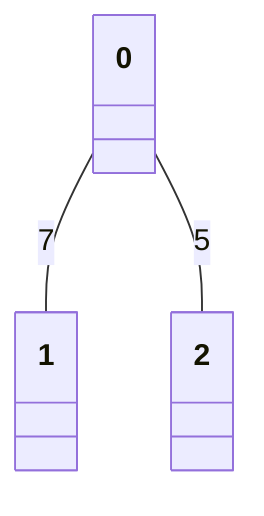

# DFS/BFS

## 꼭 필요한 자료구조 기초

### 탐색(Search)

* 많은 양의 데이터 중에서 원하는 데이터를 찾는 과정
* 그래프, 트리 등의 자료구조 안에서 탐색하는 문제
* DFS/BFS가 대표적인 탐색 알고리즘
* DFS/BFS를 제대로 이해하기 위해선 스택과 큐에 대한 이해가 필요함

### 자료구조(Data Structure)

* 데이터를 표현, 관리, 처리하기 위한 구조
* 스택과 큐가 자료구조의 기초 개념
* 삽입(Push) / 삭제(Pop)
* Overflow : 수용할 수 있는 데이터 크기가 가득찬 상태에서 Push 수행할 때 발생
* Underflow : 데이터가 전혀 들어가지 않은 상태에서 Pop 수행할 때 발생

### 스택(Stack)

* 박스 쌓기에 비유
* 선입후출(First In Last Out) / 후입선출(Last In First Out)

```txt
* push(5)
[5]

* push(5) - push(2)
[5][2]

* push(5) - push(2) - push(3)
[5][2][3]

* push(5) - push(2) - push(3) - push(7)
[5][2][3][7]

* push(5) - push(2) - push(3) - push(7) - pop()
[5][2][3]
```

### 큐(Queue)

* 대기줄에 비유
* 공정한 자료구조
* 선입선출(First In First Out)

```txt
* push(5)
[5]

* push(5) - push(2)
[2][5]

* push(5) - push(2) - push(3)
[3][2][5]

* push(5) - push(2) - push(3) - push(7)
[7][3][2][5]

* push(5) - push(2) - push(3) - push(7) - pop()
[7][3][2]
```

### 재귀 함수(Recursive Function)

* 자기 자신을 다시 호출하는 함수
* 무한대로 호출
* 파이썬 기준 호출 횟수 제한이 있으므로 최대 깊이 초과시 오류메세지 출력 후 멈춤

### 재귀 함수 종료 조건

* 종료 조건을 주어 함수가 무한히 호출되지 않도록 해야함

```python
def recursive_function(i):
    # 종료조건 명시
    if i == 100:
        return
    print(i, '번째 재귀 함수에서', i + 1, '번째 재귀 함수 호출')
    recursive_function(i + 1)

recursive_function(1)
```

* 컴퓨터 내부에서 재귀 함수 수행 시 스택 자료구조 활용
* 상당수 스택 자료구조 활용하는 알고리즘은 재귀 함수를 통해 간편하게 구현 가능 (ex: DFS)

```python
# 반복문 활용
def factorial_interative(n):
    result = 1
    for i in range(1, n + 1):
        result *= i
    return result

# 재기 함수 활용
def factorial_recursive(n):
    if n <= 1:
        return 1
    return n * factorial_recursive(n - 1)
```

* 실행 결과 동일함
* 재귀 함수가 더 간결함

### 그래프의 기본 구조

* 노드(Node)와 간선(Edge)으로 표현되며 노드를 정점(Vertex)으로도 표현함
* 간선으로 연결된 노드는 인접하다(Adjacent)라고 표현함
* 하나의 노드를 시작으로 다수의 노드를 방문함



|  |0|1|2|
|:-|:-|:-|:-|
|0|0|7|5|
|1|7|0|무한|
|2|5|무한|0|

### 인접 행렬(Adjacency Matrix)

* 2차원 배열에 각 노드가 연결된 형태를 기록하는 방식
* 파이썬 기준 2차원 리스트로 구현
* 연결되지 않은 노드끼리는 무한(Infinity)의 비용이라 작성

```python
INF = 99999999 # 무한의 비용 선언

# 2차원 리스트 인접 행렬
graph = [
    [0,7,5],
    [7,0,INF],
    [5,INF,0]
]
```

### 인접 리스트(Adjacency List)

* 모든 노드에 연결된 노드에 대한 정보를 차례대로 연결
* 연결 리스트 자료구조를 활용하여 구현
* 2차원 리스트 활용

```txt
[0] -> [1(7)] -> [2(5)]
[1] -> [0(7)]
[2] -> [0(5)]
```

```python
# 행(Row)이 3개인 2차원 리스트 = 인접 리스트
graph = [[] for _ in range(3)]

# 노드 0에 연결된 노드 정보 저장(노드, 거리)
graph[0].append((1, 7))
graph[0].append((2, 5))

# 노드 1에 연결된 노드
graph[1].append((0, 7))

# 노드 2에 연결된 노드
graph[2].append((0, 5))
```

### 인접 행렬과 인접 리스트의 차이

`인접 행렬`

* 모든 관계를 저장
* 노드 개수가 많을수록 메모리 낭비
* 특정한 두 노드가 연결되어 있는지에 대한 정보를 얻는 속도 빠름

`인접 리스트`

* 연결된 정보만을 저장
* 메모리를 효율적으로 사용
* 특정한 두 노드가 연결되어 있는지에 대한 정보를 얻는 속도 느림
