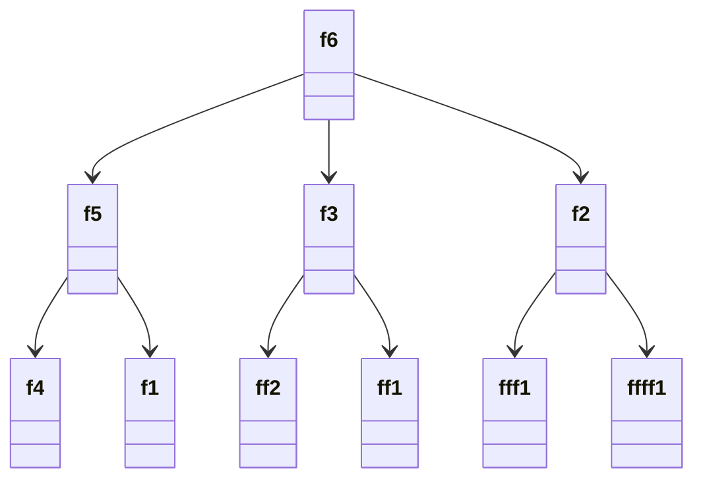

# 1로 만들기

## 문제 설명

* 정수 X가 주어질 때 정수 X에 사용할 수 있는 연산
  * X % 5 = 0 -> X / 5
  * X % 3 = 0 -> X / 3
  * X % 2 = 0 -> X / 2
  * X - 1

`X가 주어질 때 연산 4개를 사용하여 연산 횟수의 최솟값을 출력하시오.`

입력 조건

* 첫째 줄에 정수 X가 주어짐 (1 <= X <= 30,000)

```txt
26
```

출력 조건

* 첫째 줄에 연산을 하는 횟수의 최솟값을 출력

```txt
3
```

### 해결 과정



```txt
점화식 표현
ai = min(ai-1, ai/2, ai/3, ai/5) + 1

+ 1은 한수의 호출 횟수
```

* 바텀업 다나믹프로그래밍 사용
* 해당 수로 나누어질 때 한해서 점화식 적용
* 두 수 중에서 더 작은수를 구할 땐 min() 활용
