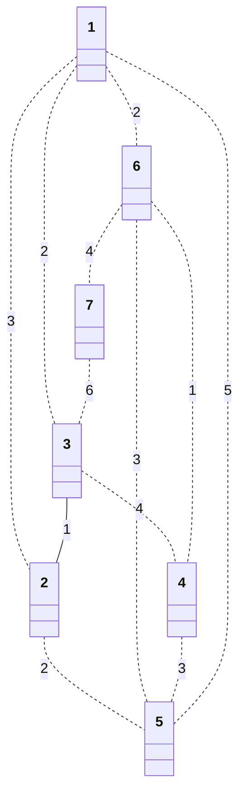
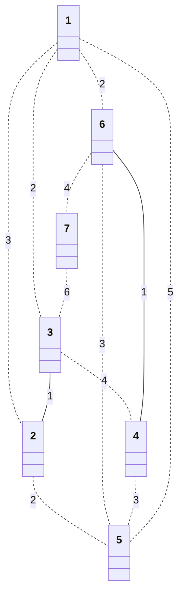
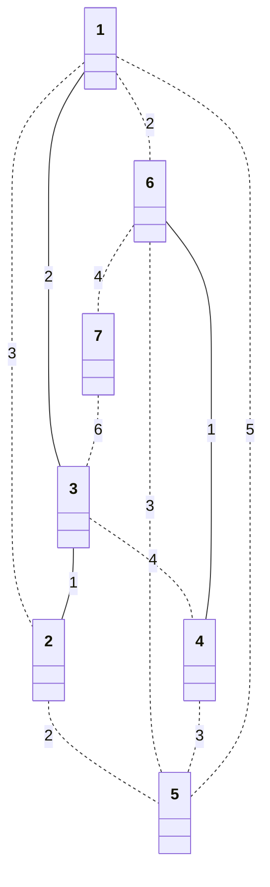
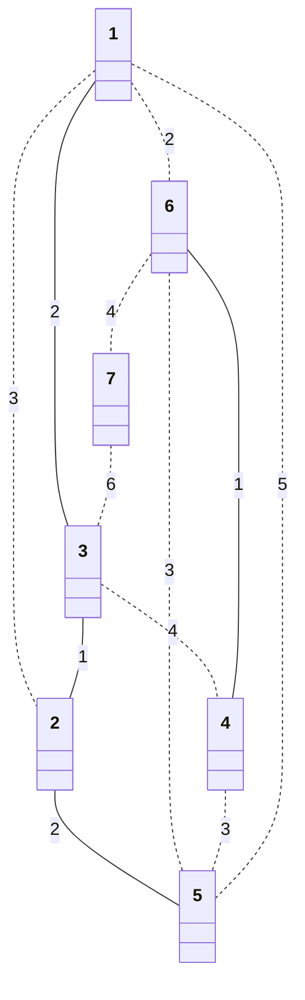
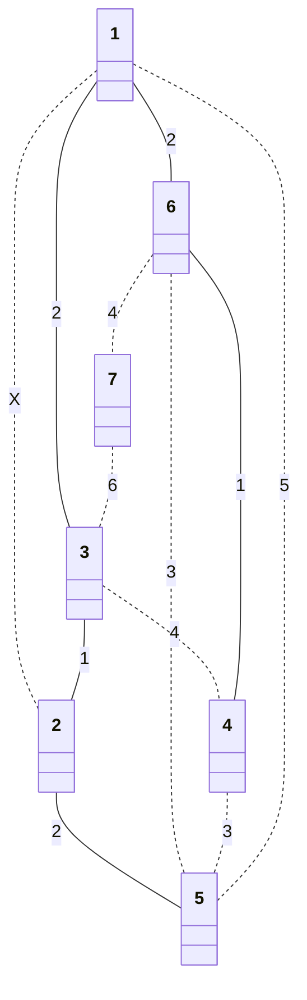
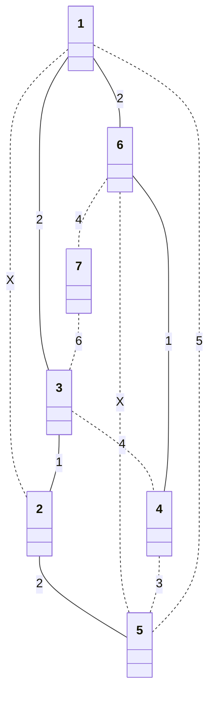
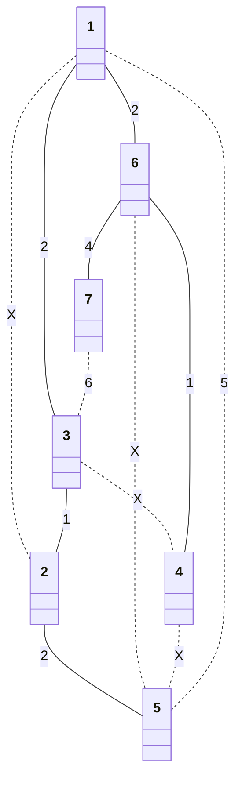
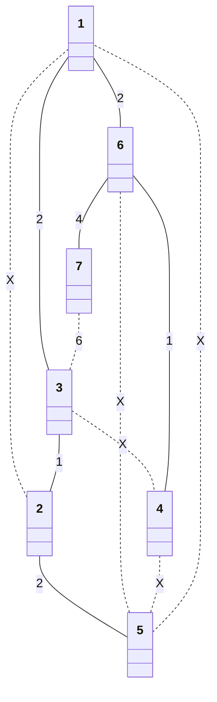
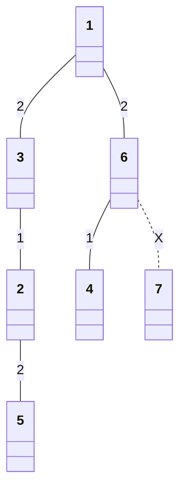

# 도시 분할 계획

## 문제 설명

* N개의 집과 M개의 길로 이루어진 마을이 있음
* 길은 어느 방향으로든지 다닐 수 있음
* 길을 유지하는데 드는 유지비가 있음
* 2개의 마을로 분리해야함
* 분리된 마을안에 집들이 서로 연결되어야함
* 마을에는 집이 하나 이상 있어야함

`위 조건을 모두 만족하면서 최소 유지비를 위해 길을 최대한 없앴을 때 유지비의 합을 출력하시오`

입력 조건

* 첫째 줄에 N과 M이 주어짐
  * (2 <= N <= 100,000, 2 <= M <= 1,000,000)
* 다음 줄 부터 M줄에 걸쳐 길의 저오 A, B, C가 주어짐
  * A번 집과 B번 집을 연결하는 유지비가 C라는 의미
  * (1 <= C <= 1,000)

```txt
7 12
1 2 3
1 3 2
3 2 1
2 5 2
3 4 4
7 3 6
5 1 5
1 6 2
6 4 1
6 5 3
4 5 3
6 7 4
```

출력 조건

* 길을 없애고 남은 유지비의 합의 최솟값을 출력

```txt
8
```

### 해결 과정

* 2개의 최소 신장트리를 만들어야 함
* 크루스칼 알고리즘 사용
* 최소 신장트리 찾은 뒤 가장 비용이 큰 간선을 제거

```txt
0.
* 그래프의 모든 간선 정보를 빼내어 정렬 수행
```


|간선|(3, 2)|(6, 4)|(1, 3)|(2, 5)|(1, 6)|(1, 2)|(6, 5)|(4, 5)|(3, 4)|(6, 7)|(5, 1)|(7, 3)|
|-|-|-|-|-|-|-|-|-|-|-|-|-|
|비용|1|1|2|2|2|3|3|3|4|4|5|6|

```txt
1.
* 첫번째 간선을 선택 --> (3, 2)
  * (3, 2) union 실행
  * 집합에 속해있지 않으므로 집합에 포함
```



|간선|(3, 2)|(6, 4)|(1, 3)|(2, 5)|(1, 6)|(1, 2)|(6, 5)|(4, 5)|(3, 4)|(6, 7)|(5, 1)|(7, 3)|
|-|-|-|-|-|-|-|-|-|-|-|-|-|
|비용|1|1|2|2|2|3|3|3|4|4|5|6|
|순서|1||||||||||||

```txt
2.
* 다음 간선을 선택 --> (6, 4)
  * (6, 4) union 실행
  * 집합에 속해있지 않으므로 집합에 포함
```



|간선|(3, 2)|(6, 4)|(1, 3)|(2, 5)|(1, 6)|(1, 2)|(6, 5)|(4, 5)|(3, 4)|(6, 7)|(5, 1)|(7, 3)|
|-|-|-|-|-|-|-|-|-|-|-|-|-|
|비용|1|1|2|2|2|3|3|3|4|4|5|6|
|순서|1|2|||||||||||

```txt

```txt
3.
* 다음 간선을 선택 --> (1, 3)
  * (1, 3) union 실행
  * 집합에 속해있지 않으므로 집합에 포함
```



|간선|(3, 2)|(6, 4)|(1, 3)|(2, 5)|(1, 6)|(1, 2)|(6, 5)|(4, 5)|(3, 4)|(6, 7)|(5, 1)|(7, 3)|
|-|-|-|-|-|-|-|-|-|-|-|-|-|
|비용|1|1|2|2|2|3|3|3|4|4|5|6|
|순서|1|2|3||||||||||

```txt
4.
* 다음 간선을 선택 --> (2, 5)
  * (2, 5) union 실행
  * 집합에 속해있지 않으므로 집합에 포함
```



|간선|(3, 2)|(6, 4)|(1, 3)|(2, 5)|(1, 6)|(1, 2)|(6, 5)|(4, 5)|(3, 4)|(6, 7)|(5, 1)|(7, 3)|
|-|-|-|-|-|-|-|-|-|-|-|-|-|
|비용|1|1|2|2|2|3|3|3|4|4|5|6|
|순서|1|2|3|4|||||||||

```txt

```txt
5.
* 다음 간선을 선택 --> (1, 6)
  * (1, 6) union 실행
  * 집합에 속해있지 않으므로 집합에 포함
```


|간선|(3, 2)|(6, 4)|(1, 3)|(2, 5)|(1, 6)|(1, 2)|(6, 5)|(4, 5)|(3, 4)|(6, 7)|(5, 1)|(7, 3)|
|-|-|-|-|-|-|-|-|-|-|-|-|-|
|비용|1|1|2|2|2|3|3|3|4|4|5|6|
|순서|1|2|3|4|5||||||||

```txt
6.
* 다음 간선을 선택 --> (1, 2)
  * (1, 2) union 실행
  * 싸이클 발생하여 포함하지 않음
```



|간선|(3, 2)|(6, 4)|(1, 3)|(2, 5)|(1, 6)|(1, 2)|(6, 5)|(4, 5)|(3, 4)|(6, 7)|(5, 1)|(7, 3)|
|-|-|-|-|-|-|-|-|-|-|-|-|-|
|비용|1|1|2|2|2|3|3|3|4|4|5|6|
|순서|1|2|3|4|5|//6|||||||

```txt
7.
* 다음 간선을 선택 --> (6, 5)
  * (6, 5) union 실행
  * 싸이클 발생하여 포함하지 않음
```



|간선|(3, 2)|(6, 4)|(1, 3)|(2, 5)|(1, 6)|(1, 2)|(6, 5)|(4, 5)|(3, 4)|(6, 7)|(5, 1)|(7, 3)|
|-|-|-|-|-|-|-|-|-|-|-|-|-|
|비용|1|1|2|2|2|3|3|3|4|4|5|6|
|순서|1|2|3|4|5|//6|//7||||||

```txt
8.
* 다음 간선을 선택 --> (4, 5)
  * (4, 5) union 실행
  * 싸이클 발생하여 포함하지 않음
```


|간선|(3, 2)|(6, 4)|(1, 3)|(2, 5)|(1, 6)|(1, 2)|(6, 5)|(4, 5)|(3, 4)|(6, 7)|(5, 1)|(7, 3)|
|-|-|-|-|-|-|-|-|-|-|-|-|-|
|비용|1|1|2|2|2|3|3|3|4|4|5|6|
|순서|1|2|3|4|5|//6|//7|//8|||||

```txt
9.
* 다음 간선을 선택 --> (3, 4)
  * (3, 4) union 실행
  * 싸이클 발생하여 포함하지 않음
```


|간선|(3, 2)|(6, 4)|(1, 3)|(2, 5)|(1, 6)|(1, 2)|(6, 5)|(4, 5)|(3, 4)|(6, 7)|(5, 1)|(7, 3)|
|-|-|-|-|-|-|-|-|-|-|-|-|-|
|비용|1|1|2|2|2|3|3|3|4|4|5|6|
|순서|1|2|3|4|5|//6|//7|//8|//9||||

```txt
10.
* 다음 간선을 선택 --> (6, 7)
  * (6, 7) union 실행
  * 집합에 속해있지 않으므로 집합에 포함
```



|간선|(3, 2)|(6, 4)|(1, 3)|(2, 5)|(1, 6)|(1, 2)|(6, 5)|(4, 5)|(3, 4)|(6, 7)|(5, 1)|(7, 3)|
|-|-|-|-|-|-|-|-|-|-|-|-|-|
|비용|1|1|2|2|2|3|3|3|4|4|5|6|
|순서|1|2|3|4|5|//6|//7|//8|//9|10|||

```txt
10.
* 다음 간선을 선택 --> (5, 1)
  * (5, 1) union 실행
  * 싸이클 발생하여 포함하지 않음
```



|간선|(3, 2)|(6, 4)|(1, 3)|(2, 5)|(1, 6)|(1, 2)|(6, 5)|(4, 5)|(3, 4)|(6, 7)|(5, 1)|(7, 3)|
|-|-|-|-|-|-|-|-|-|-|-|-|-|
|비용|1|1|2|2|2|3|3|3|4|4|5|6|
|순서|1|2|3|4|5|//6|//7|//8|//9|10|//11||

```txt
11.
* 다음 간선을 선택 --> (7, 3)
  * (7, 3) union 실행
  * 싸이클 발생하여 포함하지 않음
```


|간선|(3, 2)|(6, 4)|(1, 3)|(2, 5)|(1, 6)|(1, 2)|(6, 5)|(4, 5)|(3, 4)|(6, 7)|(5, 1)|(7, 3)|
|-|-|-|-|-|-|-|-|-|-|-|-|-|
|비용|1|1|2|2|2|3|3|3|4|4|5|6|
|순서|1|2|3|4|5|//6|//7|//8|//9|10|//11|//12|

```txt
11.
* 모두 확인 완료
* 제외하지 않은 간선의 비용을 모두 더함
  * 1 + 1 + 2 + 2 + 2 + 4 = 12
  * 가장큰 간선을 삭제 12 - 4 = 8
* 최종결과 = 8
```


