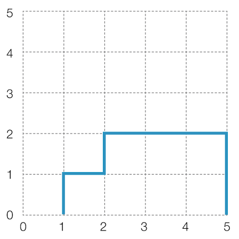
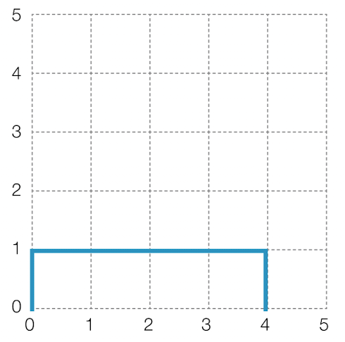

# 기둥과 보 설치

## 문제 설명

* 기둥과 보를 이용하여 벽면 구조물을 자동으로 세우는 로봇을 개발할 계획임
* 로봇의 동작을 시뮬레이션 할 수 있는 프로그램을 만들고 있음
* 프로그램은 2차원 가상 벽면에 기둥과 보를 이용한 구조물을 설치할 수 있음
* 프로그램 규칙
  * 기둥과 보의 길이 = 1, 선분으로 표시됨
  * 기둥은 바닥 위, 보의 한쪽 끝부분위, 다른 기둥위에 위치해야함
  * 보는 한쪽 끝부분 기둥 위, 양쪽 끝부분이 다른 보와 동시에 연결되어야 함
  * 바닥은 벽면의 맨 아래 지면을 의미함
* 2차원 벽면 = N x N / 각 격자는 1 X 1
* 맨 처음 벽면은 비어있음
* 기둥과 보는 격자 선의 교차점에 걸치지 않고, 격 자 칸의 각 변에 정확히 일치하도록 설치

`예시1`



* (1, 0)에서 위쪽으로 기둥을 하나 설치 후, (1, 1)에서 오른쪽으로 보를 생성
* (2, 1)에서 위쪽으로 기둥을 하나 설치 후, (2, 2)에서 오른쪽으로 보를 생성
* (5, 0)에서 위쪽으로 기둥을 하나 설치후, (5, 1)에서 위쪽으로 기둥을 설치
* (4, 2)에서 오른쪽으로 보를 설치후, (3, 2)에서 오른쪽으로 보를 설치
* (4, 2)에서 오른쪽으로 보를 먼저 설치 하지 않은 경우
  * (3, 2) 에서 보를 설치하려 하는 경우 규칙에 맞지 않으므로 설치 불가
* 기둥과 보를 삭제 가능
  * 기둥과 보를 삭제한 후 남은 기둥과 보가 규칙에 만족해야 함
  * 규칙에 만족하지 않은 경우 해당 작업은 무시됨
* 매개변수
  * 벽면의 크기 = N
  * 기둥과 보를 설치, 삭제하는 작업이 순서대로 담긴 2차원 배열 = build_frame

`모든 명령어를 수행한 후 구조물의 상태를 reutrn 하도록 solution 함수를 작성하시오`

제한 사항

* 5 <= N <= 100
* 1 <= build_frame 세로(행) 길이 <= 1,000
* build_frame 가로로(열) 길이 = 4
* build_frame원소
  * [x, y, a, b]
  * x, y = 기둥과 보의 설치 또는 삭제할 교차점 좌표
  * a = 설치 또는 삭제할 구조물의 종류 (0 = 기둥, 1 = 보)
  * b = 구조물의 변경 상태 (0 = 삭제, 1 = 설치)
  * 벽면을 벗어나게 기둥, 보를 설치하는 경우는 없음
  * 바닥에 보를 설치하는 경우는 없음
* 구조물은 교차점 좌표를 기준으로 보는 오른쪽, 기둥은 위쪽 방향으로 설치 또는 삭제함
* 구조물이 겹치도록 설하는 경우는 없음
* 없는 구조물을 삭제하는 경우는 없음
* return 규칙
  * return하는 배열은 가로(열) 길이가 3인 2차원 배열
  * [x, y, a]
    * x, y = 기둥과 보의 교차점 좌표 [가로, 세로]
      * 기둥, 보는 교차점 좌표 기준으로 오른쪽, 또는 위쪽 방향에 설치 됨을 나타냄
    * a = 구조물의 종류 (0 = 기둥, 1 = 보)
  * 배열은 x 기준으로 오름차순 정렬
  * x좌표가 같을 경우 y좌표 기준으로 오름차순 정렬
  * x,y 좌표가 모두 같을 경우 기둥이 보보다 먼저 오도록 정렬

입출력 예시

|n|build_frame|result|
|-|-|-|
|5|`[[1,0,0,1],[1,1,1,1],[2,1,0,1],[2,2,1,1],[5,0,0,1],[5,1,0,1],[4,2,1,1],[3,2,1,1]]`|`[[1,0,0],[1,1,1],[2,1,0],[2,2,1],[3,2,1],[4,2,1],[5,0,0],[5,1,0]]`|
|5|`[[0,0,0,1],[2,0,0,1],[4,0,0,1],[0,1,1,1],[1,1,1,1],[2,1,1,1],[3,1,1,1],[2,0,0,0],[1,1,1,0],[2,2,0,1]]`|`[[0,0,0],[0,1,1],[1,1,1],[2,1,1],[3,1,1],[4,0,0]]`|

입출력 예시 2

* 여덟 번째 작업 후 다음과 같은 구조물이 만들어 짐



* 아홉 번째 작업
  * (1, 1)에서 오른쪽 보를 삭제하는 경우
    * (2, 1)에서 오른쪽에 있는 보가 조건을 만족하지 못함
    * 해당 요청은 무시됨
* 열 번째 작업
  * (2, 2)에서 위쪽 방향으로 기둥을 세울 경우
    * 조건을 만족하지 않으므로 무시됨

### 해결과정

* 명령의 총 개수 <= 1,000
  * 시간복잡도 O(M²) 이상적
  * 제한시간이 넉넉하므로 시간복잡도 O(M³)로 구현
* 설치 및 삭제 연산이 이루어 질 때 전체 구조물을 확인하여 규칙과 비교
* possible() 메서드를 사용하여 구조물이 설치 및 삭제 가능한 상태인지 확인

```txt
0.
* build_frame 반복문
[0, 0, 0, 1]
[2, 0, 0, 1]
[4, 0, 0, 1]
[0, 1, 1, 1]
[1, 1, 1, 1]
[2, 1, 1, 1]
[3, 1, 1, 1]
[2, 0, 0, 0]
[1, 1, 1, 0]
[2, 2, 0, 1]
```

```txt
1.
* 작업 내용
  * [0, 0, 0, 1]
  * 좌표 = (0, 0)
  * 작업물은 기둥 = true
  * 작업물 추가 = true
  * answerList 추가
* possible() 함수 실행
  * answerList 전체 확인
  * 작업물 1 = 기둥
    * 추가
    * isOnFloor = true
    * 작업 가능
  * true

* [0, 0, 0, 1]
[2, 0, 0, 1]
[4, 0, 0, 1]
[0, 1, 1, 1]
[1, 1, 1, 1]
[2, 1, 1, 1]
[3, 1, 1, 1]
[2, 0, 0, 0]
[1, 1, 1, 0]
[2, 2, 0, 1]

* 작업 리스트
[[0, 0, 0]]
```

```txt
2.
* 작업 내용
  * [2, 0, 0, 1]
  * 좌표 = (2, 0)
  * 작업물은 기둥 = true
  * 작업물 추가 = true
  * answerList 추가
* possible() 함수 실행
  * answerList 전체 확인
  * 작업물 1 = 기둥
    * 추가
    * isOnFloor = true
    * 작업 가능
  * 작업물 2 = 기둥
    * 추가
    * isOnFloor = true
    * 작업 가능
  * true

* [2, 0, 0, 1]
[4, 0, 0, 1]
[0, 1, 1, 1]
[1, 1, 1, 1]
[2, 1, 1, 1]
[3, 1, 1, 1]
[2, 0, 0, 0]
[1, 1, 1, 0]
[2, 2, 0, 1]

* 작업 리스트
[[0, 0, 0], [2, 0, 0]]
```

```txt
3.
* 작업 내용
  * [4, 0, 0, 1]
  * 좌표 = (4, 0)
  * 작업물은 기둥 = true
  * 작업물 추가 = true
  * answerList 추가
* possible() 함수 실행
  * answerList 전체 확인
  * 작업물 1 = 기둥
    * 추가
    * isOnFloor = true
    * 작업 가능
  * 작업물 2 = 기둥
    * 추가
    * isOnFloor = true
    * 작업 가능
  * 작업물 3 = 기둥
    * 추가
    * isOnFloor = true
    * 작업 가능
  * true

* [4, 0, 0, 1]
[0, 1, 1, 1]
[1, 1, 1, 1]
[2, 1, 1, 1]
[3, 1, 1, 1]
[2, 0, 0, 0]
[1, 1, 1, 0]
[2, 2, 0, 1]

* 작업 리스트
[[0, 0, 0], [2, 0, 0], [4, 0, 0]]
```

```txt
4.
* 작업 내용
  * [0, 1, 1, 1]
  * 좌표 = (0, 1)
  * 작업물은 기둥 = false
  * 작업물 추가 = true
  * answerList 추가
* possible() 함수 실행
  * answerList 전체 확인
  * 작업물 1 = 기둥
    * 추가
    * isOnFloor = true
    * 작업 가능
  * 작업물 2 = 기둥
    * 추가
    * isOnFloor = true
    * 작업 가능
  * 작업물 3 = 기둥
    * 추가
    * isOnFloor = true
    * 작업 가능
  * 작업물 4 = 보
    * 추가
    * 한쪽 끝 부분이 기둥 [0, 0]에 위치함
    * 작업 가능
  * true

* [0, 1, 1, 1]
[1, 1, 1, 1]
[2, 1, 1, 1]
[3, 1, 1, 1]
[2, 0, 0, 0]
[1, 1, 1, 0]
[2, 2, 0, 1]

* 작업 리스트
[[0, 0, 0], [2, 0, 0], [4, 0, 0], [0, 1, 1]]
```

```txt
5.
* 작업 내용
  * [1, 1, 1, 1]
  * 좌표 = (1, 1)
  * 작업물은 기둥 = false
  * 작업물 추가 = true
  * answerList 추가
* possible() 함수 실행
  * answerList 전체 확인
  * 작업물 1 = 기둥
    * 추가
    * isOnFloor = true
    * 작업 가능
  * 작업물 2 = 기둥
    * 추가
    * isOnFloor = true
    * 작업 가능
  * 작업물 3 = 기둥
    * 추가
    * isOnFloor = true
    * 작업 가능
  * 작업물 4 = 보
    * 추가
    * 한쪽 끝 부분이 기둥 [0, 0]에 위치함
    * 작업 가능
  * 작업물 5 = 보
    * 추가
    * 한쪽 끝 부분이 기둥 [2, 0]에 위치함
    * 작업 가능
  * true

* [1, 1, 1, 1]
[2, 1, 1, 1]
[3, 1, 1, 1]
[2, 0, 0, 0]
[1, 1, 1, 0]
[2, 2, 0, 1]

* 작업 리스트
[[0, 0, 0], [2, 0, 0], [4, 0, 0], [0, 1, 1], [1, 1, 1]]
```

```txt
6.
* 작업 내용
  * [2, 1, 1, 1]
  * 좌표 = (2, 1)
  * 작업물은 기둥 = false
  * 작업물 추가 = true
  * answerList 추가
* possible() 함수 실행
  * answerList 전체 확인
  * 작업물 1 = 기둥
    * 추가
    * isOnFloor = true
    * 작업 가능
  * 작업물 2 = 기둥
    * 추가
    * isOnFloor = true
    * 작업 가능
  * 작업물 3 = 기둥
    * 추가
    * isOnFloor = true
    * 작업 가능
  * 작업물 4 = 보
    * 추가
    * 한쪽 끝 부분이 기둥 [0, 0]에 위치함
    * 작업 가능
  * 작업물 5 = 보
    * 추가
    * 한쪽 끝 부분이 기둥 [2, 0]에 위치함
    * 작업 가능
  * 작업물 6 = 보
    * 추가
    * 한쪽 끝 부분이 기둥 [2, 0]에 위치함
    * 작업 가능
  * true

* [2, 1, 1, 1]
[3, 1, 1, 1]
[2, 0, 0, 0]
[1, 1, 1, 0]
[2, 2, 0, 1]

* 작업 리스트
[[0, 0, 0], [2, 0, 0], [4, 0, 0], [0, 1, 1], [1, 1, 1], [2, 1, 1]]
```

```txt
7.
* 작업 내용
  * [3, 1, 1, 1]
  * 좌표 = (3, 1)
  * 작업물은 기둥 = false
  * 작업물 추가 = true
  * answerList 추가
* possible() 함수 실행
  * answerList 전체 확인
  * 작업물 1 = 기둥
    * 추가
    * isOnFloor = true
    * 작업 가능
  * 작업물 2 = 기둥
    * 추가
    * isOnFloor = true
    * 작업 가능
  * 작업물 3 = 기둥
    * 추가
    * isOnFloor = true
    * 작업 가능
  * 작업물 4 = 보
    * 추가
    * 한쪽 끝 부분이 기둥 [0, 0]에 위치함
    * 작업 가능
  * 작업물 5 = 보
    * 추가
    * 한쪽 끝 부분이 기둥 [2, 0]에 위치함
    * 작업 가능
  * 작업물 6 = 보
    * 추가
    * 한쪽 끝 부분이 기둥 [2, 0]에 위치함
    * 작업 가능
  * 작업물 7 = 보
    * 추가
    * 한쪽 끝 부분이 기둥 [4, 0]에 위치함
    * 작업 가능
  * true

* [3, 1, 1, 1]
[2, 0, 0, 0]
[1, 1, 1, 0]
[2, 2, 0, 1]

* 작업 리스트
[[0, 0, 0], [2, 0, 0], [4, 0, 0], [0, 1, 1], [1, 1, 1], [2, 1, 1], [3, 1, 1]]
```

```txt
8.
* 작업 내용
  * [2, 0, 0, 0]
  * 좌표 = (2, 0)
  * 작업물은 기둥 = true
  * 작업물 추가 = false
  * answerList 추가
* possible() 함수 실행
  * answerList 전체 확인
  * 작업물 1 = 기둥
    * 추가
    * isOnFloor = true
    * 작업 가능
  * 작업물 2 = 기둥
    * 추가
    * isOnFloor = true
    * 작업 가능
  * 작업물 3 = 기둥
    * 추가
    * isOnFloor = true
    * 작업 가능
  * 작업물 4 = 보
    * 추가
    * 한쪽 끝 부분이 기둥 [0, 0]에 위치함
    * 작업 가능
  * 작업물 5 = 보
    * 추가
    * 한쪽 끝 부분이 기둥 [2, 0]에 위치함
    * 작업 가능
  * 작업물 6 = 보
    * 추가
    * 한쪽 끝 부분이 기둥 [2, 0]에 위치함
    * 작업 가능
  * 작업물 7 = 보
    * 추가
    * 한쪽 끝 부분이 기둥 [4, 0]에 위치함
    * 작업 가능
  * 작업물 8 = 기둥
    * 삭제
    * 삭제 가능
  * true

* [2, 0, 0, 0]
[1, 1, 1, 0]
[2, 2, 0, 1]

* 작업 리스트
[[0, 0, 0], [4, 0, 0], [0, 1, 1], [1, 1, 1], [2, 1, 1], [3, 1, 1]]
```

```txt
9.
* 작업 내용
  * [1, 1, 1, 0]
  * 좌표 = (1, 1)
  * 작업물은 기둥 = false
  * 작업물 추가 = false
  * answerList 추가
* possible() 함수 실행
  * answerList 전체 확인
  * 작업물 1 = 기둥
    * 추가
    * isOnFloor = true
    * 작업 가능
  * 작업물 2 = 기둥
    * 추가
    * isOnFloor = true
    * 작업 가능
  * 작업물 3 = 기둥
    * 추가
    * isOnFloor = true
    * 작업 가능
  * 작업물 4 = 보
    * 추가
    * 한쪽 끝 부분이 기둥 [0, 0]에 위치함
    * 작업 가능
  * 작업물 5 = 보
    * 추가
    * 한쪽 끝 부분이 기둥 [2, 0]에 위치함
    * 작업 가능
  * 작업물 6 = 보
    * 추가
    * 한쪽 끝 부분이 기둥 [2, 0]에 위치함
    * 작업 가능
  * 작업물 7 = 보
    * 추가
    * 한쪽 끝 부분이 기둥 [4, 0]에 위치함
    * 작업 가능
  * 작업물 8 = 기둥
    * 삭제
    * 삭제 가능
  * 작업물 9 = 보
    * 삭제
    * 해당 보가 삭제되면 작업물 4의 보가 설치될 수 없음
    * 삭제 불가
  * false

* [1, 1, 1, 0]
[2, 2, 0, 1]

* 작업 리스트
[[0, 0, 0], [4, 0, 0], [0, 1, 1], [1, 1, 1], [2, 1, 1], [3, 1, 1]]
```

```txt
9.
* 작업 내용
  * [2, 2, 0, 1]
  * 좌표 = (2, 2)
  * 작업물은 기둥 = true
  * 작업물 추가 = false
  * answerList 추가
* possible() 함수 실행
  * answerList 전체 확인
  * 작업물 1 = 기둥
    * 추가
    * isOnFloor = true
    * 작업 가능
  * 작업물 2 = 기둥
    * 추가
    * isOnFloor = true
    * 작업 가능
  * 작업물 3 = 기둥
    * 추가
    * isOnFloor = true
    * 작업 가능
  * 작업물 4 = 보
    * 추가
    * 한쪽 끝 부분이 기둥 [0, 0]에 위치함
    * 작업 가능
  * 작업물 5 = 보
    * 추가
    * 한쪽 끝 부분이 기둥 [2, 0]에 위치함
    * 작업 가능
  * 작업물 6 = 보
    * 추가
    * 한쪽 끝 부분이 기둥 [2, 0]에 위치함
    * 작업 가능
  * 작업물 7 = 보
    * 추가
    * 한쪽 끝 부분이 기둥 [4, 0]에 위치함
    * 작업 가능
  * 작업물 8 = 기둥
    * 삭제
    * 삭제 가능
  * 작업물 9 = 보
    * 삭제
    * 해당 보가 삭제되면 작업물 4의 보가 설치될 수 없음
    * 삭제 불가
  * 작업물 10 = 기둥
    * 추가
    * 바닥위 x, 다른 기둥 위x, 다른 보의 한쪽 끝x
    * 추가 불가
  * false


* [2, 2, 0, 1]

* 작업 리스트
[[0, 0, 0], [4, 0, 0], [0, 1, 1], [1, 1, 1], [2, 1, 1], [3, 1, 1]]

* 정렬
  * x 기준으로 오름차순 정렬
  * x 좌표가 같을경우 y좌표 기준으로 오름차순 정렬
  * x, y 좌표가 모두 같을 경우 기둥이 보보다 먼저 오도록 정렬

* 작업 리스트
[[0, 0, 0], [0, 1, 1], [1, 1, 1], [2, 1, 1], [3, 1, 1], [4, 0, 0]]
```

`정답 = [[0, 0, 0], [0, 1, 1], [1, 1, 1], [2, 1, 1], [3, 1, 1], [4, 0, 0]]`
