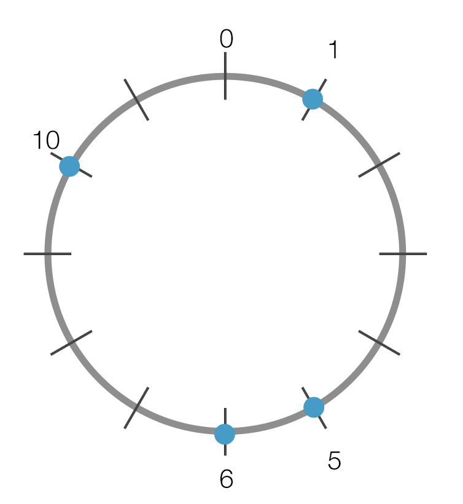
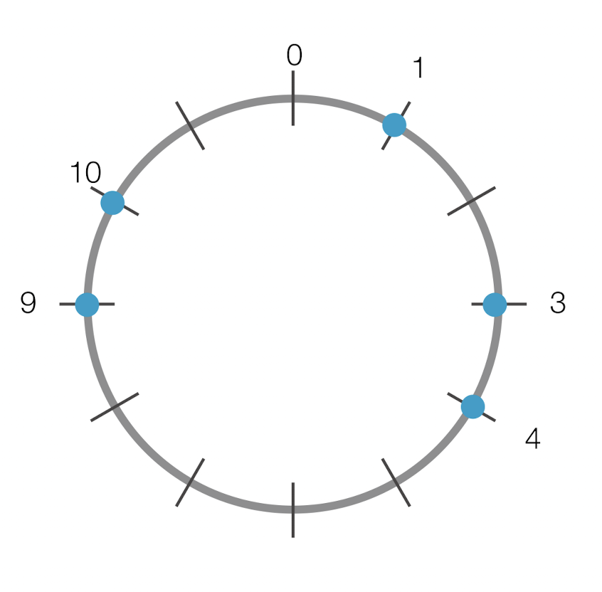

# 외벽 점검

## 문제 설명

* 레스토랑 외벽 공사를 진행
* 추운 지역이기 때문에 공사 도중에 주기적으로 외벽 상태를 점검해야함
* 레스토랑의 구조
  * 동그란 모양의 구조
  * 외벽의 총 둘레 = n미터
  * 외벽의 몇몇 지점은 손상될 수 있는 취약 지점이 있으므로 주기적으로 점검
  * 작업자들을 여러명 보내서 점검
* 점검 기준
  * 점검 시간은 1시간으로 제한
  * 작업자들이 이동할 수 있는 거리는 각각 다름
  * 최소한의 작업자를 투입하여 취약지점을 점검하고자함
  * 레스토랑의 정북 방향 = 0
  * 취약지점 위치 = 정북 방향으로 부터 시계방향으로 떨어진 거리로 나타냄
  * 작업자는 출발 지점 부터 시계 or 반시계 방향으로 이동
* 외벽의 길이 = n
* 취약 지점의 위치 배열 = weak
* 1시간 동안 이동할 수 있는 거리 배열 = dist

`취약 지점을 점검하기 위해 보내야 하는 친구 수의 최솟값을 return하도록 solution 함수를 작성하시오`

제한 사항

* 1 <= n <= 200
* 1 <= weak.length <= 15 (자연수)
  * 서로 다른 두 취약점의 위치가 같은 경우는 없음
  * 취약 지점의 위치는 오름차순 정렬
  * 0 <= weak의 원소 <= n - 1 (정수)
* 1 <= dist <= 8
  * 1 <= dist의 원소 <= 100 (자연수)
* 작업자를 모두 투입해도 취약지점을 전부 점검할 수 없는 경우 -1 return

입출력 예시

|n|weak|dist|result|
|-|-|-|-|
|12|`[1, 5, 6, 10]`|`[1, 2, 3, 4]`|2|
|12|`[1, 3, 4, 9, 10]`|`[3, 5, 7]`|1|

입출력 예시 1



* 작업자 투입 예시
  * 4m를 이동할 수 있는 작업자는 10m 지점에서 출발하여 시계방향으로 돌아 1m 위치에 있는 취약 지점에서 외벽점검을 마침
  * 2m를 이동할 수 있는 작업자는 4.5m 지점에서 출발해 6.5지점에서 외벽 점검을 마침
* 여러 방법이 있지만 두명보다 적게 투입하는 경우는 없음
* 최소 2명 투입

입출력 예시 2



* 작업자 투입 예시
  * 7m를 이동할수 있는 작업자가 4m에서 출발하여 반시계 방향으로 점검을 돌면 모든 취약지점을 점검할 있음
* 최소 1명 투입

### 해결과정

* weak, dist의 길이가 매우 작음
* 완전 탐색으로 접근해볼 수 있음
* 작업자를 나열하는 모든 경우의 수를 각각 확인
* 작업자를 최소 몇 명 배치하면 되는지 계산
* 원형의 나열(2번 예시)
  * 길이를 2배로 늘려서 원형을 1자 형태로 만드는 작업
  * n = 12
  * 취약지점 = [1, 3, 4, 9, 10]
  * 취약지점 원형 : 1, 3, 4, 9, 10, 13, 15, 16, 21, 22
    * 1, (2), 3, 4, (5), (6), (7), (8), 9, 10, (11), (12)
    * 13, (14), 15, 16, (17), (18), (19), (20), 21, 22, (23), (24)
* 작업자 이동거리의 모든 경우의 수 (순열)
  * [3 ,5 ,7]
  * [3 ,7 ,5]
  * [5 ,3 ,7]
  * [3 ,7 ,3]
  * [7 ,3 ,5]
  * [7 ,5 ,3]
  * 각각의 경우에 대하여 취약 지점을 모두 검사할 수 있는지 확인

```txt
과정
weak = [1, 3, 4, 9, 10, 13, 15, 16, 21, 22]
permutations = [[3, 5, 7], [3, 7, 5], [5, 3, 7], [5, 7, 3], [7, 3, 5], [7, 5, 3]]
---
순열 = [3, 5, 7]
출발 취약 지점 = 1
이동 거리 = 3
취약 지점 + 이동 거리 = 4
취약 지점 = 9
이동 거리 = 5
취약 지점 + 이동 거리 = 14
answer = 2
---
순열 = [3, 7, 5]
출발 취약 지점 = 1
이동 거리 = 3
취약 지점 + 이동 거리 = 4
취약 지점 = 9
이동 거리 = 7
취약 지점 + 이동 거리 = 16
answer = 2
---
순열 = [5, 3, 7]
출발 취약 지점 = 1
이동 거리 = 5
취약 지점 + 이동 거리 = 6
취약 지점 = 9
이동 거리 = 3
취약 지점 + 이동 거리 = 12
answer = 2
---
순열 = [5, 7, 3]
출발 취약 지점 = 1
이동 거리 = 5
취약 지점 + 이동 거리 = 6
취약 지점 = 9
이동 거리 = 7
취약 지점 + 이동 거리 = 16
answer = 2
---
순열 = [7, 3, 5]
출발 취약 지점 = 1
이동 거리 = 7
취약 지점 + 이동 거리 = 8
취약 지점 = 9
이동 거리 = 3
취약 지점 + 이동 거리 = 12
answer = 2
---
순열 = [7, 5, 3]
출발 취약 지점 = 1
이동 거리 = 7
취약 지점 + 이동 거리 = 8
취약 지점 = 9
이동 거리 = 5
취약 지점 + 이동 거리 = 14
answer = 2
---
순열 = [3, 5, 7]
출발 취약 지점 = 3
이동 거리 = 3
취약 지점 + 이동 거리 = 6
취약 지점 = 9
이동 거리 = 5
취약 지점 + 이동 거리 = 14
answer = 2
---
순열 = [3, 7, 5]
출발 취약 지점 = 3
이동 거리 = 3
취약 지점 + 이동 거리 = 6
취약 지점 = 9
이동 거리 = 7
취약 지점 + 이동 거리 = 16
answer = 2
---
순열 = [5, 3, 7]
출발 취약 지점 = 3
이동 거리 = 5
취약 지점 + 이동 거리 = 8
취약 지점 = 9
이동 거리 = 3
취약 지점 + 이동 거리 = 12
취약 지점 = 13
이동 거리 = 7
취약 지점 + 이동 거리 = 20
answer = 2
---
순열 = [5, 7, 3]
출발 취약 지점 = 3
이동 거리 = 5
취약 지점 + 이동 거리 = 8
취약 지점 = 9
이동 거리 = 7
취약 지점 + 이동 거리 = 16
answer = 2
---
순열 = [7, 3, 5]
출발 취약 지점 = 3
이동 거리 = 7
취약 지점 + 이동 거리 = 10
취약 지점 = 13
이동 거리 = 3
취약 지점 + 이동 거리 = 16
answer = 2
---
순열 = [7, 5, 3]
출발 취약 지점 = 3
이동 거리 = 7
취약 지점 + 이동 거리 = 10
취약 지점 = 13
이동 거리 = 5
취약 지점 + 이동 거리 = 18
answer = 2
---
순열 = [3, 5, 7]
출발 취약 지점 = 4
이동 거리 = 3
취약 지점 + 이동 거리 = 7
취약 지점 = 9
이동 거리 = 5
취약 지점 + 이동 거리 = 14
취약 지점 = 15
이동 거리 = 7
취약 지점 + 이동 거리 = 22
answer = 2
---
순열 = [3, 7, 5]
출발 취약 지점 = 4
이동 거리 = 3
취약 지점 + 이동 거리 = 7
취약 지점 = 9
이동 거리 = 7
취약 지점 + 이동 거리 = 16
answer = 2
---
순열 = [5, 3, 7]
출발 취약 지점 = 4
이동 거리 = 5
취약 지점 + 이동 거리 = 9
취약 지점 = 10
이동 거리 = 3
취약 지점 + 이동 거리 = 13
취약 지점 = 15
이동 거리 = 7
취약 지점 + 이동 거리 = 22
answer = 2
---
순열 = [5, 7, 3]
출발 취약 지점 = 4
이동 거리 = 5
취약 지점 + 이동 거리 = 9
취약 지점 = 10
이동 거리 = 7
취약 지점 + 이동 거리 = 17
answer = 2
---
순열 = [7, 3, 5]
출발 취약 지점 = 4
이동 거리 = 7
취약 지점 + 이동 거리 = 11
취약 지점 = 13
이동 거리 = 3
취약 지점 + 이동 거리 = 16
answer = 2
---
순열 = [7, 5, 3]
출발 취약 지점 = 4
이동 거리 = 7
취약 지점 + 이동 거리 = 11
취약 지점 = 13
이동 거리 = 5
취약 지점 + 이동 거리 = 18
answer = 2
---
순열 = [3, 5, 7]
출발 취약 지점 = 9
이동 거리 = 3
취약 지점 + 이동 거리 = 12
취약 지점 = 13
이동 거리 = 5
취약 지점 + 이동 거리 = 18
answer = 2
---
순열 = [3, 7, 5]
출발 취약 지점 = 9
이동 거리 = 3
취약 지점 + 이동 거리 = 12
취약 지점 = 13
이동 거리 = 7
취약 지점 + 이동 거리 = 20
answer = 2
---
순열 = [5, 3, 7]
출발 취약 지점 = 9
이동 거리 = 5
취약 지점 + 이동 거리 = 14
취약 지점 = 15
이동 거리 = 3
취약 지점 + 이동 거리 = 18
answer = 2
---
순열 = [5, 7, 3]
출발 취약 지점 = 9
이동 거리 = 5
취약 지점 + 이동 거리 = 14
취약 지점 = 15
이동 거리 = 7
취약 지점 + 이동 거리 = 22
answer = 2
---
순열 = [7, 3, 5]
출발 취약 지점 = 9
이동 거리 = 7
취약 지점 + 이동 거리 = 16
answer = 1
---
순열 = [7, 5, 3]
출발 취약 지점 = 9
이동 거리 = 7
취약 지점 + 이동 거리 = 16
answer = 1
---
순열 = [3, 5, 7]
출발 취약 지점 = 10
이동 거리 = 3
취약 지점 + 이동 거리 = 13
취약 지점 = 15
이동 거리 = 5
취약 지점 + 이동 거리 = 20
취약 지점 = 21
이동 거리 = 7
취약 지점 + 이동 거리 = 28
answer = 1
---
순열 = [3, 7, 5]
출발 취약 지점 = 10
이동 거리 = 3
취약 지점 + 이동 거리 = 13
취약 지점 = 15
이동 거리 = 7
취약 지점 + 이동 거리 = 22
answer = 1
---
순열 = [5, 3, 7]
출발 취약 지점 = 10
이동 거리 = 5
취약 지점 + 이동 거리 = 15
취약 지점 = 16
이동 거리 = 3
취약 지점 + 이동 거리 = 19
취약 지점 = 21
이동 거리 = 7
취약 지점 + 이동 거리 = 28
answer = 1
---
순열 = [5, 7, 3]
출발 취약 지점 = 10
이동 거리 = 5
취약 지점 + 이동 거리 = 15
취약 지점 = 16
이동 거리 = 7
취약 지점 + 이동 거리 = 23
answer = 1
---
순열 = [7, 3, 5]
출발 취약 지점 = 10
이동 거리 = 7
취약 지점 + 이동 거리 = 17
취약 지점 = 21
이동 거리 = 3
취약 지점 + 이동 거리 = 24
answer = 1
---
순열 = [7, 5, 3]
출발 취약 지점 = 10
이동 거리 = 7
취약 지점 + 이동 거리 = 17
취약 지점 = 21
이동 거리 = 5
취약 지점 + 이동 거리 = 26
answer = 1
```
